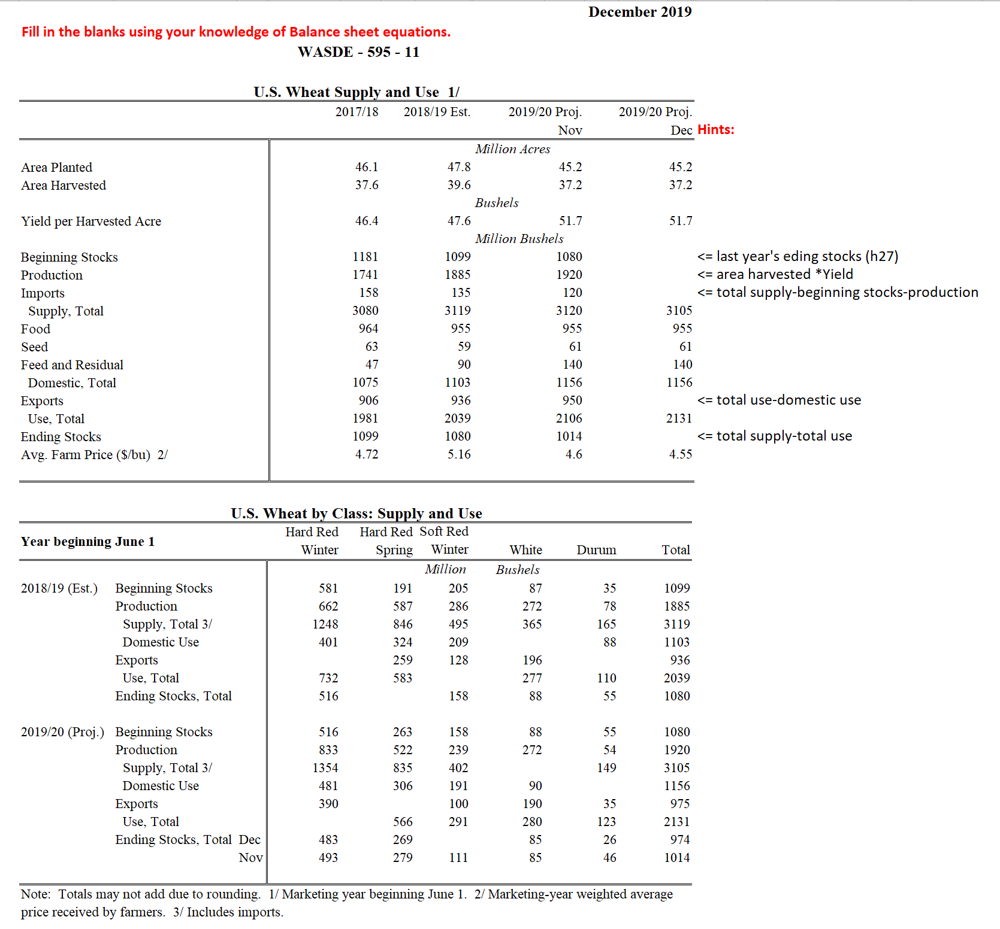
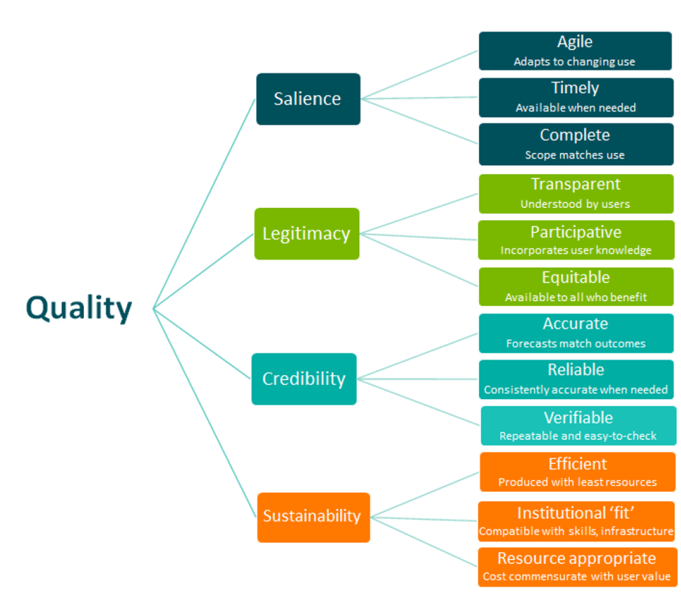

# Agricultural Outlook Tools and Approaches {#outlook}

## Balance Sheet Approach

One of the similarities between various outlook programs around the world is the use of the balance sheet approach for commodity outlook. The most prominent example of the balance sheet forecasts is the World Agricultural Supply and Demand Estimates (WASDE) reports from USDA. These reports cover numerous crops and livestock and are based on separate balance sheets that are maintained for over 90 countries. It is widely considered that these reports serve as benchmark balance sheet estimates for nearly all market participants. 

[WASDE reports](http://www.usda.gov/oce/waob/wasde/wasde.htm) are released monthly 12 times a year and contain marketing year forecasts. Marketing year definitions vary by commodity, such as September -- August for corn and soybeans, June -- May for wheat, August -- July for cotton, January -- December for cattle and December -- January for hogs.  For all commodities, the first forecast is released in May before the marketing year and is finalized about 19 months later. Each month the forecast of the same event (marketing year value) is updated as more information becomes available.  This means that the forecast errors become smaller across the forecasting cycle as more information becomes available. 

There are a number of agencies that participate in the WASDE process.  For example, 

- [Foreign Agriculture Service (FAS)](http://www.fas.usda.gov/): information regarding foreign production, use and trade 

- [Economic Research Service (ERS)](http://www.ers.usda.gov/): identifies important economic effects and implications for prices, quantity supplied and quantity demanded. 

- [Farm Service Agency (FSA)](http://www.fsa.usda.gov/): describes current policy environment and farmers’ reaction to current policies. 

- [Agricultural Marketing Service (AMS)](http://www.ams.usda.gov./): provides current price and marketing reports 

- [World Agricultural Outlook Board (WAOB)](http://www.usda.gov/agency/oce/waob/waob.htm): coordinates the interagency process used to produce WASDE estimates 

### Balance Sheet

A balance sheet is one of the most popular tools used in fundamental analysis of commodity prices. It can be constructed for a particular crop, sector or the entire country. Typically, a construction of a balance sheet starts with building a supply side, followed by consumption, or use, side.  The balance sheet ties both sides together by rationing available supplies to competing uses.  Thus, a balance sheet is a joint system of interrelated forecasts. In a generic balance sheet, total supply is a sum of beginning stocks, production and imports.  Total consumption (use) is a sum of domestic consumption, exports and residual.  Endings stocks is a difference between total supply and total consumption.

## Exercise {-}

The following activity will help you practice your understanding of balance sheet equations described above. 

Using the information presented in the screenshot, complete the relevant line items of the WASDE balance sheet.

While the balance sheet is a popular tool, it is often combined with and relies upon various other approaches to forecasting. These include time series approaches, futures-based models and other methods that will be discussed in detail later in this training course. But before we get to discussing specific methods, we need to discuss various criteria used for selecting what and how to forecast.

## Forecast selection and evaluation

Nelson et al, 2022a argues that forecast quality is a much broader concept than accuracy. He mentions that forecast quality criteria should include availability, accuracy, timeliness, reliability and relevance, as shown in the figure below.

Source: Cash et al. (2002), Nelson et al, (2022a).

Based on these general criteria, ABARES evaluates the performance of their forecasts from three perspectives: the ability of the system to produce accurate forecasts, the ability of the system to meet changing institutional objectives (see Nelson, 2018), and the value–in–use of its forecasts to diverse end-users (see Nelson et al. (2022b) for details).  This approach echoes the US two-prone system with a focus on what forecasts should be made and how to produce the most credible forecasts.  The first question of what forecasts should be made stems from resource constraints.  Since outlook information is a public good, the public will always request more information as it is distributed free of charge. However, resource limitations force public forecasters to focus on areas of biggest priorities.  The challenge is that determining these biggest priorities may be difficult.  This process boils down to determining forecasts of highest value and is revisited periodically during the times of budget pressures. 

The research report provided below is one of the most recent examples of such efforts.  This report describes both the reasons for providing public agricultural outlook information and the foundation for assessing its value.  The report provides a number of methods that can be used to assess the value of information and provides a framework for prioritizing data products. 

[From Farm Income to Food Consumption: Valuing USDA Data Products](https://static1.squarespace.com/static/598b4450e58c624720903ae6/t/59a768c0f9a61e6c2d049c0f/1504143555758/cfare-data-review-report-1-14-v4.pdf)

After reviewing the report, it is important to reflect and discuss which methods and approaches mentioned in it would be appropriate for prioritizing data products in your situation. The answers to these questions will not be straight forward as political pressures are often present and may dictate what the priorities are regardless of economic reasons.  

The second component of forecast evaluation focuses on concepts of accuracy and efficiency. Academic literature describes a wide variety of methods that have been used to analyze the accuracy and efficiency of USDA forecasts.  Most studies assume that forecasters minimize a symmetric linear or quadratic loss function, mean absolute errors (MAE) and root mean squared errors (RMSE) are the standard measures of accuracy reflecting the magnitude of forecast errors. Only one study by Bora, Katchova and Kuethe (2020) explored the possibility of asymmetric loss functions for USDA forecast providers with different weights placed on over or under-prediction. 

While most studies evaluate forecasts as published values, some (e.g., Isengildina, MacDonald and Xie, 2012) express forecasts as percent changes from previous year’s values. The evaluation of accuracy typically focuses on forecast errors measured as the difference between the realized value and the predicted value and expressed in either raw units or percentages or log percentages to control for changes in levels of the forecasted variable over time.  These measures are typically used to compare the accuracy of forecasts in question to a certain benchmark, such as naïve forecast (using Theil’s U statistic), or a time-series forecast, or another alternative forecast. Modified Diebold Mariano test (Harvey, Leybourne, and  Newbold, 1997) is typically used to determine whether the difference between the accuracy of two alternative forecasts is significantly different from zero. The results of this evaluation would indicate which forecast is more accurate relative to the included alternative. 

Most of the previous studies conduct accuracy evaluation at each forecast horizon, as fixed-event forecasts are expected to become more accurate across the forecasting cycle as more information becomes available.  Some recent studies proposed methods to compare the relative accuracy of path forecasts (e.g., Patton and Timmerman, 2012).  For example, Bora, Katchova, and Kuethe (2022) use the tests of multi-horizon superior predictive ability proposed by Quaedvlieg (2021) that jointly consider all horizons along the entire projection path. These tests evaluate the average superior predictive ability for a path forecast with larger loss at some horizons that is compensated by superior performance at other horizons when compared to the alternative path forecast.

Some studies (e.g., Isengildina, MacDonald and Xie, 2012) also used a directional accuracy test developed by Henriksson and Merton (1981). The test is based on 2 x 2 contingency tables, reflecting the direction of year-to-year change in each variable forecast for each stage’s average forecast. The frequency with which forecasts and actual realizations of the variable decrease or increase together is compared with the expected frequency of independent directional changes using a Chi-squared statistic.  The results of this evaluation reflect a proportion of time the forecast correctly predicts the directional change in the realized value. 
Theil (1958) developed the original the framework for rolling-event forecast efficiency testing, which was extended by Mincer and Zarnowitz (1969). Nordhaus (1987) introduced the utilization of these tests into a fixed-event framework, and Clements (1997) extended this to the pooling of rolling sets of fixed-event forecasts. The fundamental measures of optimal forecasts are bias and efficiency (Diebold and Lopez, 1998). 

Tests of bias examine whether positive and negative forecast errors cancel out and the average forecast errors equal zero. Traditionally, this condition has been tested with a simple t-test, but some studies have applied a regression-based test of bias developed by Holden and Peel (1990), in which the error is regressed against a constant.  The benefit of this approach is that it allows for heteroscedasticity and autocorrelation correction of standard errors following Newey and West (1987). Variations of this test include a trend variable to assess whether bias has changed over time. Other studies (e.g., Sanders and Manfredo, 2007) have applied what is widely known as a Mincer-Zarnowitz equation to assessing forecast bias.  In this approach a realized value is regressed against the constant, the forecast and the error term. This regression tests whether forecasts are unbiased (coefficient for constant is zero) and properly scaled (coefficient for forecast is one). However, estimation of this equation may encounter statistical challenges, especially when there is lack of stationarity in either realized values or forecasts. 

Tests of weak-form efficiency typically examine whether forecast errors are orthogonal to forecasts themselves and prior forecast errors (e.g., Sanders and Manfredo, 2002, 2003; Isengildina, MacDonald and Xie, 2012).  Some studies also assessed orthogonality to other information available at the time the forecasts are made (e.g. Isengildina-Massa, Karali, and Irwin, 2013).  Studies also assessed changes in forecast accuracy over time (e.g., Bailey and Brorsen, 1998; Sanders and Manfredo, 2003; Isengildina, MacDonald and Xie, 2012) by regressing absolute forecast errors against a constant and a time trend. Fixed-event forecast errors should also demonstrate a pattern of errors decreasing across the forecast horizon as more information becomes available (e.g., Isengildina-Massa, Karali, and Irwin, 2013; Isengildina, MacDonald and Xie, 2012).

Weak form efficiency of fixed-event forecasts also implies independence of forecast revisions (Nordhaus, 1987). According to Nordhaus, if forecasts are weak form efficient, revisions should follow a random walk.  This condition has been tested extensively in previous studies by Isengildina, Irwin and Good (2006), Sanders, Altman, and Manfredo (2009), Isengildina, Irwin and Good (2013), Isengildina, MacDonald and Xie (2012), MacDonald and Ash (2016), and MacDonald, Ash and Cooke (2017), among others. However, the interpretation of this test results has changed over time.  While some earlier studies (Isengildina, Irwin and Good, 2006; Sanders, Altman, Manfredo, and Anderson, 2009; Isengildina, Irwin and Good, 2013; Isengildina, MacDonald and Xie, 2012) interpreted evidence of correlation in forecast revisions as “smoothing,” suggesting of strategic behavior of forecast providers, Goyal and Adjemian (2023) argued that correlated revisions may also be explained by information rigidities that cause forecasts to be infrequently or only partially updated. The authors apply a framework developed by Coibion and Gorodnichenko (2015) to demonstrate that information rigidities are the most likely cause of correlations in crop production revisions due to production and yield data that is either too costly to obtain or too noisy.

Numerous studies demonstrated that combination forecasts provide accuracy benefits (e.g., Colino and Irwin, 2010; Colino, Irwin, and Garcia, 2012, Hoffman et al, 2015).  A related test developed by Harvey, Leybourne and Newbold (1998) assesses forecast encompassing. If a preferred forecast encompasses an alternative forecast, then the alternative forecast provides no useful information beyond that provided in the preferred forecast. This test is based on a regression used to evaluate the covariance between the preferred forecast error series (dependent variable) and the difference between the preferred and alternative forecast error series (independent variable). If this covariance is zero, the preferred forecast is said to encompass the competing one. This test has been used extensively to demonstrate whether additional information, such as time series forecasts (e.g. Sanders and Manfredo, 2003), or futures-based forecasts (e.g, Hoffman et al, 2015; Colino and Irwin, 2010) may help improve USDA forecasts.

As most USDA forecasts are released at multiple horizons (several months, quarters or years, another important criterion for their evaluation is informational content. Earlier studies (e.g., Sanders and Manfredo, 2008) used the direct test developed by Vuchelen and Gutierrez (2005). for evaluation of information content across multiple horizons. This test establishes the contribution of longer-horizon forecasts relative to the information contained in shorter-horizon forecasts.  More recent studies (e.g., Luke and Tonsor, 2023; Bora, Katchova, and Kuethe, 2022) used the test developed by Breitung and Knuppel (2021) to determine the maximum informative projection horizon by comparing the projections’ mean-squared prediction errors to the variance of the evaluation sample. The benefit of this test is that it circumvents the need to compare projections to naïve benchmarks and instead compares prediction errors to the variance of realized values.

As some USDA forecasts are released as part of joint system (e.g. WASDE forecasts, farm income forecasts), it is important to consider the joint accuracy of the system and interaction of various components within a system. Only a few studies addressed these issues. For example, Isengildina-Massa et al, 2021, used a test developed by Sinclair, Stekler, and Carnow (2015) which combines the single accuracy measure for each component of the joint forecasts into a vector. Specifically, it focuses on the difference (Mahalanobis distance) between the mean vectors of forecasts and outcomes while allowing for scale differences across different variables and a nonzero correlation between variables. The rationale behind this test is that if a vector of forecasts is similar to the vector of the outcomes, it can be substituted for the actual data for decision making.

The interaction of various components is usually determined through evaluation of the residual variable (ending stocks for WASDE, or Net Cash Income or Net Farm Income for farm income) and determination of the contribution of errors in various components of the balance sheet (or income statement) to the errors in the residual variable. Most studies have approached it using regression or correlation analysis (e.g., Botto et al, 2006; Isengildina-Massa, Karali, Irwin, 2013; Isengildina-Massa et al, 2019).  Recently, Goyal et al, 2023 proposed the use of machine learning methods to decompose USDA ending stocks errors to avoid the issues of multicollinearity inherent in regression analysis used for this purpose. The authors use extreme gradient boosting trees to determine the relative importance of each component of the balance sheet.  Additionally, Goyal et al, 2023, use Shapley additive explanations (SHAP) values (Lundberg and Lee, 2017) to quantify the extent to which ending stocks prediction error increases or decreases from the average prediction error due to the inclusion of a given predictor variable. 

Finally, it is important to note that all of the above methods have been developed and applied to point forecasts, which is how most of the USDA projections are published.  Only price forecasts have been published as ranges until 2019. Most of the early studies reduced these ranges to their midpoint for evaluation, with some exceptions. Sanders and Manfredo (2003) were the first to calculate “hit rates,” the proportion of time the forecast interval contained the final value. Isengildina, Irwin and Good, (2004) applied Christoffersen’s (1998) unconditional coverage test to determine whether forecast hit rates was significantly different from the implied confidence level. Isengildina-Massa and Sharp (2012) extended this analysis to account for asymmetry in forecast errors.  A number of studies (e.g, Adjemian, Bruno, and Robe, 2020; Trujillo-Barrera, Garcia, Mallory, 2016; Isengildina-Massa, Irwin, and Good, 2010, 2011) proposed various methods of improving USDA price forecast intervals.

One of the most important aspects of forecast evaluation is data availability.  Forecasting agencies around the world (e.g., [Farm Income and Wealth Statistics Forecast and Estimate Data Archive](https://www.ers.usda.gov/data-products/farm-income-and-wealth-statistics/), and Cameron and Nelson, 2022) have made extensive efforts to enable users to evaluate the accuracy of their forecasts by providing historical databases of their projections and realized values. This process helps ensure transparency and communication between forecast providers and data users.

Historical databases are also necessary for computing forecasts, as most of them are based on patterns in the data over time.  The following modules will describe the use of `R` codes for data manipulation and computation of various forecasts relevant for modern agricultural outlook. We will illustrate coding and forecasting concepts using US forecasts due to data availability, but these concepts can be applied to Maharashtra's data in a similar manner. Modules \@ref(data) -- \@ref(stocks-use) describe various forecasting approaches and Module \@ref(accuracy) will focus on forecast accuracy evaluations.

## References

- Nelson, R., A. Cameron, C. Xia, and P. Gooday. 2022a. “The ABARES Approach to Forecasting Agricultural Commodity Markets – Description and Design Choices.” Australian Agribusiness Review 30, 6, ISSN: 1883-5675.

- Cash, D., Clark, W.C., Alcock, F., Dickson, N.M., Eckley, N. and Jäger, J. (2002), Salience, Credibility, Legitimacy and Boundaries: Linking Research, Assessment and Decision Making, John F Kennedy School of Government Faculty Research Working Papers Series RWP02-046. Harvard University, Cambridge.

- Nelson, R. (2018), ‘The future of public sector forecasting in Australian agriculture’, Australasian Agribusiness Perspectives 21, paper 16.

- Nelson, R., Cameron, A., Xia, C., Howden, M. and Miller, M. (2022b), The Australian Agricultural Forecasting System - System Documentation, Technical Report 22.02. Australian Bureau of Agricultural and Resource Economics and Sciences, Canberra.

- Bora, S.S., A.L. Katchova, and T.H. Kuethe.  2020. “The Rationality of USDA Forecasts under Multivariate Asymmetric Loss.” American Journal of Agricultural Economics 103(3): 1006-1033.

- Isengildina-Massa, O., S. MacDonald, and R. Xie. 2012. “A comprehensive Evaluation of USDA Cotton Forecasts.” Journal of Agricultural and Resource Economics 37(1):98-113.

- Harvey, D., Leybourne, S., & Newbold, P. (1997). Testing the equality of prediction mean squared errors. International Journal of forecasting, 13(2), 281–291. doi: 10.1016/S01692070(96)007194

- Patton, A. and Timmermann, A. (2007). “Properties of Optimal Forecasts under Asymmetric Loss and Nonlinearity. Journal of Econometrics, 140:884–918.

- Quaedvlieg, Rogier. 2021. “Multi-Horizon Forecast Comparison.” Journal of Business & Economic Statistics 39: 40–53.

- Bora, Siddhartha S., Ani L. Katchova, and Todd H. Kuethe. 2022. “The Accuracy and Informativeness of Agricultural Baselines.” American Journal of Agricultural Economics, DOI: 10.1111/ajae.12350

- Henriksson, R. D. and R. C. Merton. “On Market Timing and Investment Performance. II. Statistical Procedures for Evaluating Forecasting Skills.” Journal of Business 54(1981):513–533.

- Theil, H. 1958. Economic Forecasts and Policy. Amsterdam: North-Holland Publishing Co.

- Mincer, J. A. and V. Zarnowitz. “The Evaluation of Economic Forecasts.” In J. A. Mincer,ed., Economic Forecasts and Expectations: Analysis of Forecasting Behavior and Performance, Washington, DC: National Bureau of Economic Research, 1969, 1–46.

- Nordhaus, W. D. “Forecasting Efficiency: Concepts and Applications.” The Review of Economics and Statistics 69(1987):667–674.

- Clements, M. P. 1997. “Evaluating the Rationality of Fixed-Event Forecasts.” Journal of Forecasting 16: 225–239.

- Diebold, F. X. and J. A. Lopez. “Forecasting Evaluation and Combination.” In G. S. Maddala and C. R. Rao, eds., Handbook of Statistics 14: Statistical Methods in Finance, Amsterdam: North-Holland, 1998, 241–268.

- Holden, K. and Peel, D. A. (1990). “On Testing for Unbiasedness and Efficiency of Forecasts.” Manchester School, 58:120–127.

- Newey, W. K., and K. D. West. 1987. “A Simple, Positive Semi-Definite, Heteroskedasticity and Autocorrelation.” Econometrica 55: 703–8.

- Sanders, D. and Manfredo, M. (2007). “Rationality of U.S. Department of Agriculture Livestock Price Forecasts: A Unified Approach.” Journal of Agricultural and Applied Economics 39(1): 75-85.

- Sanders, D. R. and M. R. Manfredo. (2002). “USDA Production Forecasts for Pork, Beef, and Broilers: An Evaluation.” Journal of Agricultural and Resource Economics 27:114–128.

- Sanders, D. and Manfredo, M. (2003). “USDA Livestock Price Forecasts: A Comprehensive Evaluation.” Journal of Agricultural and Resource Economics, 28:316–336.

- Isengildina-Massa, O., B. Karali, and S.H. Irwin. 2013. “When Do the USDA Forecasters Make Mistakes?” Applied Economics 45(36):5086-5103.

- Bailey, D. and Brorsen, B. 1998. “Trends in the Accuracy of USDA Production forecasts for Beef and Pork”. Journal of Agricultural and Resource Economics, 23:515–526.

- Isengildina, O., S.H. Irwin, and D.L. Good. 2006. “Are Revisions to USDA Crop Production Forecasts Smoothed?” American Journal of Agricultural Economics 88(4):1091-1104.

- Sanders, D.R., I.J. Altman, M.R. Manfredo, and R. Anderson. 2009. “Using USDA Production Forecasts: Adjusting for Smoothing.” Journal of ASFMRA, 134-142.

- Isengildina, O., S.H. Irwin, and D.L. Good. 2013. “Do Big Crops Get Bigger and Small Crops Get Smaller? Further Evidence on Smoothing in USDA Forecasts.” Journal of Agricultural and Applied Economics 45(1):95-107.

- MacDonald, S. and M. Ash. 2016. “Detecting the Sources of Information Rigidity: Analyzing Forecast Bias and Smoothing in USDA’s Soybean Forecasts.” AAEA paper. (https://ageconsearch.umn.edu/record/235349)

- MacDonald, S., M. Ash and B. Cooke. 2017. “The Evolution of Inefficiency in USDA’s Forecasts of U.S. and World Soybean Markets.” MPRA Paper No. 87545 (https://mpra.ub.uni-muenchen.de/87545/)

- Goyal, R., and M.K. Adjemian. 2023. “Information Rigidities in USDA Crop Production Forecasts.” American Journal of Agricultural Economics, in press, doi.org/10.1111/ajae.12373.

- Coibion, O., and Y. Gorodnichenko. 2015. “Information rigidity and the expectations formation process: a simple framework and new facts.” American Economic Review. https://doi.org/10.1257/aer.20110306

- Colino, E.V., and S.H. Irwin. 2010. “Outlook vs. Futures: Three Decades of Evidence in Hog and Cattle Markets.” American Journal of Agricultural Economics, 92(1): 1-15.

- Colino, E.V., S.H. Irwin, and P. Garcia. 2012. “Improving the Accuracy of Outlook Price Forecasts.” Agricultural Economics 42: 357-371.

- Hoffman, L.A., X.L. Etienne, S.H. Irwin, E.V. Colino, and J.I. Toasa. 2015. “Forecast Performance of WASDE Price Projections for U.S. Corn.” Agricultural Economics 46(S1):157-171.

- Harvey, D. I., Leybourne, S. J., & Newbold, P. (1998). Tests for forecast encompassing. Journal of Business & Economic Statistics, 16(2), 254–259. doi: 10.1080/07350015.1998.10524759

- Sanders, D. and Manfredo, M. (2008). “Multiple Horizons and Information in USDA production forecasts.” Agribusiness, 24(1):55-66.

- Vuchelen, J., & Gutierrez, M.-I. (2005). A direct test of the information content of the OECD growth forecasts. International Journal of Forecasting, 21, 103–117.

- Luke, J.R., and G.T. Tonsor. 2023. “USDA Long-Term Meat Trade Projections: A Comprehensive Evaluation.” Journal of Agricultural and Applied Economics, DOI:10.1017/aae.2023.13.

- Breitung, EvJrg, and Malte Knüppel. 2021. “How Far Can We Forecast? Statistical Tests of the Predictive Content.” Journal of Applied Econometrics 36: 369–92.

- Isengildina-Massa, O., Karali, B., Kuethe, T. H., and Katchova, A. L. (2021). “Joint Evaluation of the System of USDA’s Farm Income Forecasts.” Applied Economic Perspectives and Policy, 43(3):1140–1160.

- Sinclair, T.M., H.O. Stekler, and W. Carnow. 2015. Evaluating a Vector of the Fed’s Forecasts. International Journal of Forecasting 31: 157–164.

- Botto, A.C., O. Isengildina, S.H. Irwin, and D.L. Good. 2006. “Accuracy Trends and Sources of Forecast Errors in WASDE Balance Sheet Categories for Corn and Soybeans.” American and Applied Economics Association Annual Meeting, Long Beach, CA, July 23-26, 2006.

- Isengildina-Massa, O., Karali, B., Kuethe, T. H., and Katchova, A. L. 2019.  “Sources of Errors in USDA’s Net Cash Income Forecasts”. NCCC-134 paper. (https://ageconsearch.umn.edu/record/309630/?ln=en).

- Goyal, R. M.K.Adjenian, J. Glauber, and S. Meyer. 2023. “Decomposing USDA Ending Stocks Forecast Errors.” Journal of Agricultural and Resource Economics, ISSN: 1068-5502 (Print); 2327-8285 (Online) doi: 10.22004/ag.econ.320674

- Lundberg, S.M., and S.-I. Lee. 2017. “A unified approach to interpreting model predictions.” Advances in Neural Information Processing Systems 4765-4774. Accessed at:https://doi.org/10.48550/arXiv.1705.07874

- Isengildina, O., S.H. Irwin, and D.L. Good. 2004. “Evaluation of USDA Interval Forecasts of Corn and Soybean Prices.” American Journal of Agricultural Economics 86(4):990-1004.

- Christoffersen,P.F. “Evaluating Interval Forecasts.” International Economic Review 39(1998):841–62.
Isengildina‐Massa, O., and J.L. Sharp. 2012. “Evaluation of USDA Interval Forecasts Revisited: Asymmetry and Accuracy of Corn, Soybean, and Wheat Prices.” Agribusiness 28(3):310-323.

- Adjemian, M.K., V.G. Bruno, and M.A. Robe. 2020. “Incorporating Uncertainty into USDA Commodity Price Forecasts.” American Journal of Agricultural Economics 102(2):696-712.

- Trujillo-Barrera, A, Garcia, P., and Mallory, M.L. 2016. “Price Density Forecasts in the U.S. Hog Markets: Composite Procedures.” American Journal of Agricultural Economics  98(5): 1529-1544.

- Isengildina-Massa, O., S.H. Irwin, and D.L. Good. 2010. “Quantile Regression Estimates of Confidence Intervals for WASDE Price Forecasts.” Journal of Agricultural and Resource Economics 35(3):545-567.

- Isengildina-Massa, O., S.H. Irwin, D.L. Good, and L. Massa. 2011. “Empirical Confidence Intervals for USDA Commodity Price Forecasts.” Applied Economics 43(26):3789-3803.

- Cameron, A., and R. Nelson. 2022. “Enabling Users to Evaluate the Accuracy of ABARES Agricultural Forecasts.” Australian Agribusiness Review, 30,7, ISSN: 1883-5675.

