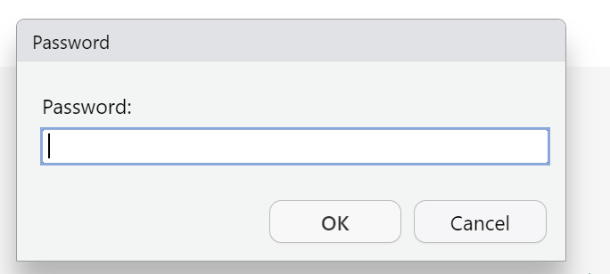
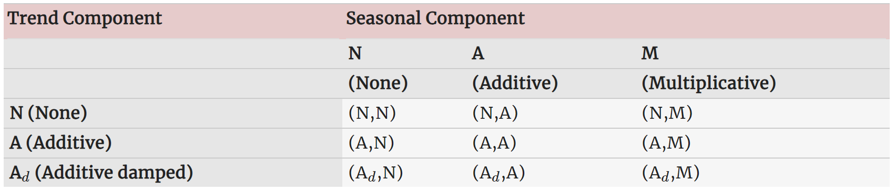

# Data Manipulation, Visualization, and Basic Forecasting {#data}

In this module, we will focus on importing, manipulating, and visualizing time series data in R. Towards the end, we will estimate and graph the forecasts of a few basic time series models. 

For much of our exercises, we will focus on importing data from the [USDA's NASS QuickStat database](https://quickstats.nass.usda.gov/).

## Optional Materials {-}

While these modules are intended to be self-contained, they also builds on the [MTED-R-Training Workshop from the USDA](https://usda-ers.github.io/MTED-R-Training/){target="_blank"}. It would be a worthwhile exercise to review the `R` basics, Data Importation, and Data Transformation modules. This would prove especially useful for the new(er) users to `R`.

## NASS QuickStats

The US Department of Agriculture (USDA)'s National Agricultural Statistical Agency (NASS) has an `R` package called `tidyUSDA` that connect directly to an API and allow users to download QuickStats data into R [(See MTED-R-Training)](https://usda-ers.github.io/MTED-R-Training/chp1/mod2/import-and-export-data.html#import-nass-quickstats-data-optional). 

Additionally, `tidyUSDA` gives you the option to explore the QuickStats data at either the county or national level. This allows you to quickly visualize data for report generation.

In this example, we will use an API to pull the `Corn GRAIN - PRICE RECEIVED, MEASURED in $ / BU` data series into R. Our ultimate goal is to explore the data and perform some basic forecasting.

We will reserve the appropriateness of these models for later modules.

### `tidyUSDA` package

If you have never done so before, you will need to install the `tidyUSDA` package. You can achieve this using the syntax below. We suggest running this code in your **console** and not scripts. You need only install this package once.

```{r install.USDA, eval=FALSE}
install.packages("tidyUSDA")
```

In subsequent sessions you can simply call the library into memory.

```{r tidylib, eval = FALSE}
library(tidyUSDA)
```

### API Key

In order to pull data directly into `R`, you will need an API key. Please [click here](https://quickstats.nass.usda.gov/api) to obtain a free API Key via email. Return to this page once you have been issued a key.

Now that you have obtained your API Key, you can supply it to `R` for use in this and subsequent sessions. There are two approaches you could take:

- Approach 1: You could hard code your key (Not Recommended). 

```{r, eval = FALSE}
key <- "PUT-YOUR-KEY-HERE"
```

If you R scripts will be public facing, this might not be a desirable option.

- Approach 2: Using the `keyring` package

To help with protecting your API Key we will use the `keyring` package. **You might need to install the `keyring` package first. You can repeat the same step from earlier to get this done.**

```{r setkey, eval = FALSE}
# Load the Keyring package
library(keyring)

# Save the API Key (you can skip this step in the future)
#tidyUSDA is the nickname assigned for my API key combination
key_set("tidyUSDA")

```

A password prompt should now appear. Enter your API key and click `OK`.



For this and future sessions, you can use the `key_get` command to retrieve the key. To do so, run the following line

```{r getkey}
key <- keyring::key_get("tidyusda")
```

We can determine the relevant parameters for our search by visiting the [Quickstat website](https://quickstats.nass.usda.gov/). 

We are ready to pull the `Corn GRAIN - PRICE RECEIVED, MEASURED in $ / BU` data. 

### Writing a Query {#query}

```{r pullcorn}
corn <- tidyUSDA::getQuickstat(
  key = key,
  program = "SURVEY",
  sector = "CROPS",
  group = "FIELD CROPS",
  commodity = "CORN",
  category = "PRICE RECEIVED",
  data_item = "CORN, GRAIN - PRICE RECEIVED, MEASURED in $ / BU",
  domain = "TOTAL",
  geographic_level = "NATIONAL",
  state = "US TOTAL",
#Must specify years as character variables 
  year = as.character(c(1990:2019))
)
```

We have a number of approaches to be able to see the full data. First, we can call the variable name in `R`.^[We will suppress the results here to conserve on space.]

```{r, eval=FALSE}
corn
```

You can use the `View()` command to explore the dataset in your `R` environment.

```{r, eval = FALSE}
View(corn)
```

Alternatively, we can view the head (first `n` observations). `R` will default to `n = 6`.

```{r}
head(corn, 10)
```

## Data Manipulation
### Subseting & Filtering

Much of our data manipulations can be performed quickly (and efficiently) using the `tidyverse` environment. The `tidyverse` package is very powerful and speeds up the data cleaning and manipulation process. 

Unfortunately, much of the functionalities we require are missing from the package of the same name.

For our purpose and given our focus on time series, we will use the `fpp3` package that accompanies the free text [Forecasting: Principles and Practice (3rd ed) by Rob J Hyndman and George Athanasopoulos](otexts.com/fpp3/). This package builds on the `tidyverse`/`dplyr` packages and a number of packages dedicated to time series models.

This would be a good time to install the `fpp3` package.

```{r fpp3, eval = FALSE}
install.packages("fpp3")  
```

Since there are so many columns we can drop all irrelevant columns. For our purposes assume further that we need to get the price data at the `annual (YEAR)` frequency.

It might prove easier if we were to first `filter` the data on the `reference_period_desc` column. We will keep only the rows that meet the criterion of `reference_period_desc == "YEAR"`

```{r}
library(fpp3)
# View the column names
colnames(corn)

# Keep only the yearly prices
corn.annual <- filter(corn,
                      reference_period_desc == "YEAR")
```

Next, we would like to keep only the relevant columns. To do so, we can use the `select()` function to drop all columns **except** `year` and `Value`.

```{r}
# Keep the "year" and "Value" columns
corn.annual2 <- select(corn.annual, year, Value)
corn.annual2
```

Now, we can declare the `year` as our time index.

```{r}
corn.ts <- as_tsibble(corn.annual2, index = "year")
corn.ts
```

Notice now that the `corn.ts` series is now a `tsibble` object arranged in chronological order (on the `year` column).

---
### Pipe Operator

You can imagine how cumbersome our code will get as we start to perform multiple operations on our raw dataset. We will need to save the intermediary dataframes along the way. Our variable names could quickly become long and confusing.

To get around this, we can use the pipe operator, `%>%`. This allows us to pass arguments (think intermediary dataframes) from left to right and perform various functions/operations at each stage. For simplicity, we will utilize this function extensively throughout this training module.

Revisiting the problem above, we can recreate `corn.ts` in a single line of code. We will store the results in an aptly named variable, `corn.ts.pipe`.

```{r}
corn.ts.pipe <- corn %>% 
  filter(reference_period_desc == "YEAR") %>% 
  select(year, Value) %>% 
  as_tsibble(index = "year")
corn.ts.pipe
```

If you are skeptical, you can check whether **all** (pairwise) elements in both `tsibble` objects are the same:

```{r}
identical(corn.ts, corn.ts.pipe)
```

88888 As a shortcut, you can insert the pipe operator using the following syntax:
  - Windows: CTRL + SHIFT + M
  - Mac: COMMAND + SHIFT + M
  
## Visualizing Time Series Data

### Time plot

We are ready to create our first time series plot. We will use the `autoplot()` command from the `fpp3` package. For those familiar with the `ggplot` environment, the syntax is very similar.

```{r}
corn.ts %>% autoplot(Value, col = "blue") + 
  labs(title = "Annual Corn Prices Received",
        y = "$/bu", 
       x= "Year",
       caption = "Source: NASS QuickStat") + theme_bw()
```

The argument `theme_bw()` is optional. It was used to change the presentation of the graph and gridlines. You can change yours to other default options such as `theme_classic()`, `theme_minimal()` or even a user-defined customized theme.

8888
Try removing the `+ theme_bw()` portion of your code to see what the results now look like.

### Walkthrough Exercise {-}

Let us return to the [Writing a Query Section](\@query). 

1. Instead of annual data, get the monthly corn prices. 

- It is easiest to filter rows where `freq_desc=="MONTHLY"`
- Keep only the `year`, `reference_period_desc`, and `values` column. 

2. We will declare the data as a `tsibble` object. This will require some work though to allow `R` to recognize we have a `yearmonth` variable. You can use the `paste0` function to first create a variable that combines both the `year` and `reference_period_desc` columns. 

3. Store your variable as `corn.monthly` and drop all irrelevant columns.

4. Be sure to use the pipe operator to achieve Tasks 1 -- 3 in a single step.

5. Now produce an `autoplot` of `corn.monthly`. Be sure to add appropriate labels.

#### Solution {-}

```{r, warning=FALSE}
corn.monthly <- corn %>% 
  # Keep only the Months
  filter(freq_desc== "MONTHLY") %>%
# Keep only the year, reference_period_desc, and Value columns
  select(year, reference_period_desc, Value) %>% 
# Create a yearmonth object
  mutate(date = yearmonth(paste0(year, reference_period_desc))) %>% 
# declare date as index
  as_tsibble(index = date) %>% 
# Keep only the date and Value column
  select(date, Value)

corn.monthly %>% autoplot(Value, col = "darkblue") + 
  labs(title = "Monthly Corn Prices",
       y = "$/bu") +
  theme_bw()
```

```{block, type = "rmdtip"}

- Are you able to identify any unique features in this data? Is it trending for example, do we observe seasonality? etc.

- How could you forecast this series?

In the ensuing sections, we will explore the properties of `corn.monthly` a bit closer.

```

### Visualizing corn.monthly (further) {#viz}

A researcher might be potentially concerned about seasonality in prices received. We have several *graphical* tools at our disposal to explore this a bit further.

#### Subseriesplots

```{r}
corn.monthly %>% gg_subseries(Value) + 
  labs(title = "Subseries Plot", y = "") + 
  theme_bw()
```

The `gg_subseriesplot` command creates a plot of our corn price data grouped by month (across all years). The blue lines correspond to each monthly average. 

From these graphs we do not observe the presence of strong seasonality in the price data.

#### Seasonplots

If we would like to see the time plot of the data against the seasons (months) instead, we can use the `gg_season` command. In fact, this is usually a good way to identify years that were potential outliers.

```{r}
corn.monthly %>% 
  gg_season(Value, labels = "both") +
  labs(title = "Seasonal Plot of Corn Prices") + 
  theme_bw()
```
The `year.labels = "both"` argument adds the year labels to the graph (on both sides) instead of in a legend. It is particularly useful in our case since the colors quickly get confusing with so many years.

Adding the argument `polar = TRUE` to the `gg_season` function produces a variation using polar coordinates. Adding this option makes the time series axis circular rather than horizontal.

```{r}
corn.monthly %>% gg_season(Value, polar = TRUE, 
                           labels = "both") + 
  labs(title = "Seasonal Plot of Corn Prices") + 
  theme_bw()
```

In general, the summary of the seasonal plot above matches the `autoplot` earlier. We observe that:

- In the earlier periods, the values across months were closer (less volatile) than in later periods. 

- On average, prices between 2010 and 2015 were higher than the remaining periods. 

- 2015 to 2019 saw a temperance of prices, albeit higher than the beginning of the sample.


#### Autocorrelation (ACF) Plot

Correlation, as a statistical concept, measures the degree of a **linear** relationship between two variables.

Autocorrelation, on the other hand, measures the **linear** relationship between a variable and its lagged (past) values. The higher the correlation (positive or negative) between our variable, $y_t$ and its lags $y_{t-k}$ where $k = 1, \ldots, T$, the closer the correlation coefficient is to $\pm 1$

```{r}
corn.monthly %>% ACF(Value, lag_max = 36) %>% 
  autoplot() + 
  labs(title = "ACF: Monthly Corn Prices") + 
  theme_bw()
  
```

The value of `r ((corn.monthly %>% ACF(Value))$acf %>% round(3))[2]` at lag 1 implies that last month's corn price explains more than `r (((corn.monthly %>% ACF(Value))$acf %>% round(3))[2])^2*100`% of the current corn price.^[The correlation stats squared.] The correlation value slowly goes to zero as we go further back in time. This indicates that we have a series with a trend. We will discuss further later.

To view the correlation statistic at each lag, you can copy and paste the code below.

```{r}
corn.monthly %>% ACF(Value) 
```

## Benchmark Forecasting Methods

```{r, echo = FALSE}
corn.monthly %>% autoplot(Value) + 
  labs(title = "Monthly Corn Prices", y = "$/bu") + theme_bw()
```

Given our graph above, how could you go about forecasting the corn prices for the next 3 years ($h = 36$)?

Below, we will discuss some of the most basic (benchmark) models that are often considered when doing outlook forecasting.

### Mean Method

A potential model could be to set our forecast equivalent to the mean of the historical series.

```{r}
# The forecast horizon (h) = 36 or 3 years
corn.mean <- corn.monthly %>% 
  #Specify the model and give it a name (Optional)
  model(meanf = MEAN(Value)) %>% 
  # Specify the horizon
  forecast(h = "3 years")

corn.mean %>% head()
```

You should note that the forecasts produced and stored in `corn.mean` have prediction intervals assigned to them. In this case, it is unspectacular as there is no true uncertainty in our forecasts since we are making projections at the historical mean of the data. Unsurprisingly, all the forecasts are equal to the mean of the data.

```{r}
mean(corn.monthly$Value)
```
We can now visualize the data along with the mean forecasts.

```{r}

corn.mean %>% autoplot(corn.monthly, color = "red",
                       level = NULL) + 
  theme_bw()
```

The `level = NULL` argument turns off the prediction Intervals (PI) associated with each point in our forecast. If it were omitted, we have

```{r}
corn.mean %>% autoplot(corn.monthly, 
                       color = "red",
                       size = 1) + 
  labs(title = "Mean Forecast",
       subtitle = "Corn (Monthly)") +
  theme_bw()
```

### Naïve Method

Another useful method could be to set the forecasts equal to the **last observed value**. 

```{r}
# Looking at the last 6 values
tail(corn.monthly$Value)

#Last value
last(corn.monthly$Value)
```

This is especially true if we believe in the Efficient Market hypothesis and in cases where the market is exceptionally volatile or even mean reverting.

```{r}
# The forecast horizon (h) = 36 or 3 years
corn.naive <- corn.monthly %>% 
  model(naive = NAIVE(Value)) %>% forecast(h = "3 years")

corn.naive
```

Notice here that the forecasts for all future periods are set to the last observed value, `r last(corn.monthly$Value)`

Visualizing the data and the forecasts

```{r}
# plot the forecasts stored in corn.naive
corn.naive %>% autoplot(corn.monthly, 
                        color = "purple", 
                        size = 1)  + 
  labs(title = "Naïve Forecast",
       subtitle = "Corn (Monthly)") +
  theme_bw()
```

```{block, type = "rmdnote"}

Notice that despite setting the forecasts all equal to the last value, the uncertainty around our predictions (as shown by the PIs) is increasing as we go further into the future.

```

### Seasonal Naïve Method

If we assume that the series displays seasonality, we could use a **seasonal naïve method**. The forecast for a given season (say January 2020 and February 2020) is equal to the last value observed for that same season (January 2019 and February 2019, respectively, in this case).

```{r}
# The forecast horizon (h) = 36 or 3 years
corn.snaive <- corn.monthly %>% 
  model(snaive = SNAIVE(Value)) %>% 
  forecast(h = "3 years")

corn.snaive
```

```{r}
# plot the forecasts stored in corn.snaive
corn.snaive %>% autoplot(corn.monthly,
                         color = "darkgreen",
                         size = 1)  + 
  labs(title = "Seasonal Naïve Forecast",
       subtitle = "Corn (Monthly)") + 
  theme_bw()
```

Notice that the pattern (over a year) repeats itself into the future. This is the nature of the seasonal naive model. All January values will be assigned the last observed January value.

You can view the last 12 values (since we ended the dataset in December 2019) to validate this:

```{r}
tail(corn.monthly,12)
```

### Drift Method

In this case, we assign the forecasts as the last value plus the average change over the sample. This is equivalent to drawing a straight line between the first and last observations and extrapolating out into the future.

This is commonly referred to as the RW (Naïve) model with drift.

```{r}
# The forecast horizon (h) = 36 or 3 years
corn.drift <- corn.monthly %>% model(
  drift = RW(Value ~ drift ())) %>% 
  forecast(h = 36)

corn.drift
```

```{r}
# plot the forecasts stored in corn.drift
corn.drift %>% autoplot(corn.monthly,
                        color = "cornflowerblue",
                        size = 1)  + 
  labs(title = "Randow Walk with Drift Forecast",
       subtitle = "Corn (Monthly)") + 
  theme_bw()
```

### Visualing all Forecasts

Like much of coding in `R`, there are several ways to accomplish a given task. We will take the path of least resistance and first save all 4 models in a single `fable`.

```{r}

models.corn <- corn.monthly %>% model(
  mean = MEAN(Value),
  naive = RW(Value),
  snaive = SNAIVE(Value),
  drift = RW(Value ~ drift())
  ) %>% 
  forecast(h = "3 years")

models.corn
```

```{block, type = "rmdnote"}

Unlike the codes earlier, you will notice I used the `RW` function to estimate the Naïve model instead of the `NAIVE` function. Both functions are equivalent. `RW` is more flexible however, as it allows us to add the `drift` term.

```

You might find it best to turn off the PIs for this plot. Otherwise, our graph will be too busy.

```{r}
models.corn %>% autoplot(corn.monthly,
                         level = NULL,
                         size = 0.8)  + 
  labs(title = "Forecasts - Corn (Monthly)") +
  theme_bw() 
  
```

```{block, type = "rmdnote"}

The emphasis of this module is not to perform model comparisons. We will have a module dedicated to that later. Instead, this module is centered on improving your competence and familiarity with workhorse models and the associated `R` syntax.
```

## Exercise {-}

Using the `tidyUSDA` package, import price data (at the **National Level**) for a commodity of your choice from 2000 -- 2019. Following the data manipulation techniques earlier in this module, 

i. obtain the monthly series declared as a `tsibble` object.

ii. present a time series plot of the data.

iii. produce a `subseriesplot` and `seasonplot` of your data. 
iv. produce the `ACF` plot of the data.

v. what do you observe from parts ii -- iv.

vi. produce and plot the 4 Benchmark forecasts of your data. Use a forecast horizon of 2 years (h = 24).


### Exponential Smoothing

There are many ways to do exponential smoothing. The general idea is always to have a declining weight given to observations. The more recent an observation, the more important it should be to our forecasting (and hence a higher weight).

#### Simple exponential Smoothing

**This method is suitable for forecasting data with no clear trend or seasonal pattern.** For a moment, let us ignore the trend present in the our corn prices data.

We could estimate the simple exponential smoothing model forecasts as follows

```{r}
corn.ses <- corn.monthly %>% 
  model(ses = ETS(Value ~ error("A")+ trend("N") + season("N")))
```


You can view the stored model fit (in-sample) using the `augment` function

```{r}
corn.ses %>% augment()
```

Producing our forecasts as before:

```{r}
corn.ses %>% forecast(h = "3 years")
```

You will quickly notice that the point estimates of our forecasts are flat over the forecast horizon. However, the uncertainty of that estimate will be increasing over time. That is, the prediction interval (PI) is increasing.

We can visualize the information stored in `corn.ses` using the `autoplot` command.


```{r}
corn.ses %>% forecast(h = "3 years") %>% 
  autoplot(corn.monthly,
           color = "goldenrod",
           size = 1) +
  labs(title = "Simple Exponential Smoothing",
       subtitle = "Corn (Monthly)") +
  theme_bw()
```
We might need to consider other exponential smoothing techniques that could account for a potential trend.


Exponential smoothing methods are classified by their "Trend" and "Seasonal" components, $T$ & $S$, respectively.




**Error:** 
  Additive ("A") or Multiplicative ("M")

**Trend:** 
  None ("N"), additive ("A"), multiplicative ("M"), or damped ("Ad" or "Md")

**Season:** 
  None ("N"), additive ("A"), or multiplicative ("M")

