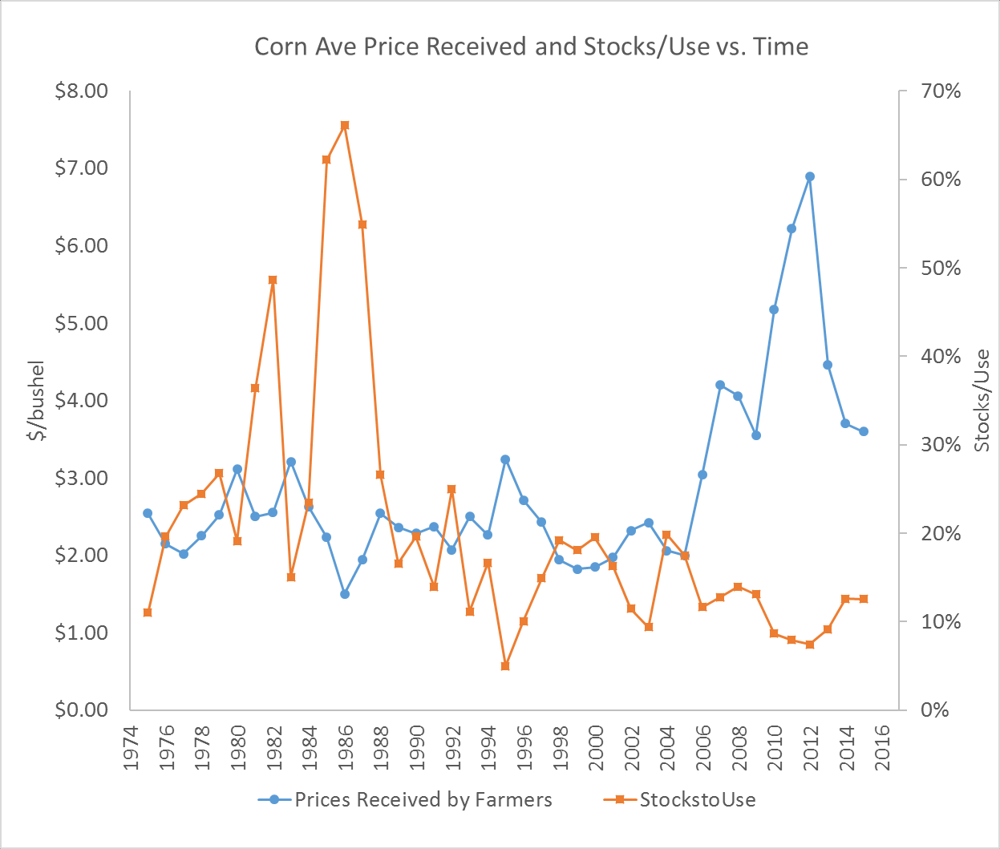

# Forecasting Prices Using Stocks-to-Use Ratios {#stocks-use}

In the previous module we discussed forecasting various balance sheet components relating to either supply or utilization (consumption). Therefore, a commodity forecasting balance sheet reflects the current information about fundamental forces that drive market prices. This fundamental supply and demand information is connected to market prices through the ending stocks variable. This variable is not forecasted, but rather calculated as the difference between total supply and total use in the balance sheet. As a residual between supply and use, ending stocks represent a degree of scarcity (or plenitude) of the commodity in the market. As a result of this relative scarcity, low ending stocks are typically associated with high prices (and vice versa). Hence, the relationship between ending stocks and price is often used to forecast prices. We will start by introducing price forecasting models developed by Irwin and Good and described in this [article](https://farmdocdaily.illinois.edu/2016/04/relationship-between-stock-to-use-and-prices.html).

Before we formally examine the relationship between ending stocks and prices, it is customary to “normalize” ending stocks by the level of use through calculating a stocks-to-use ratio.  The figure below shows changes in the average price of corn received as well as the stocks-to-use of corn over time. 



Pronounced stocks-to-use spikes occurred in the 1982/1983 and 1985/1986, 1986/1987, 1987/1988 marketing years. Those exceptionally high stocks relative to use was a result of government commodity programs designed to keep prices from falling too far. Specifically, the stocks were help primarily in the Farmer-Owned-Reserve or by the Commodity Credit Corporation (Westcott and Hoffman 1999). Both programs were designed to keep bushels off the market and thus buoying prices. During periods of prolonged excesses, however, it becomes very costly for the government to procure and store large quantities of the commodity and it has a continuing depressing effect on market prices because the market knows the government holds large stockpiles. Farm legislation (‘The Farm Bill’ is re-negotiated every four years by congress) has trended toward more market-oriented approaches to supporting agriculture, and one can observe a marked decline in stocks-to-use over time.

Aside from the wild swings in the 1980’s, the series still seem to show a negative relationship between stocks-to-use and prices, as one would expect. Figure 1 from the article shows these two series as a scatter-plot with stocks-to-use on the x-axis and price on the y-axis.


Good and Irwin argue that the relationship should be viewed in the context of two different eras. The first era spans from 1990-91 through 2005-06 and consists of the lower and more horizontal cluster of points in Figure 1. The second era spans from 2007-08 through 2014-15 and it contains the upper and more steeply sloped cluster of points in Figure 1. Note that 2006-07 is treated as a transition year is this division of eras. 

The two eras represented in Figure 1 are mainly differentiated by the substantial increase in ethanol demand for corn that began in 2007-08. That is, the outward shift in the demand curve resulted in higher prices, for a given level of supply, than was the case in the period prior to 2007-08. While the corn supply curve likely did not shift at first, there was undoubtedly movement along the supply curve as higher prices resulted in expanded corn acreage. The resulting large outward shift in the demand curve and movement along a relatively inelastic (price insensitive) supply curve meant that a stocks to-use ratio of a given magnitude was associated with a higher price in the latter era than in the former era. 
Next, the authors estimate the relationship between the average marketing year price and ending stock-to-use ratio for the two different eras over 1990-91 through 2014-15. A reciprocal regression specification is used, so that:

$\text{Corn Price} = a + \frac{b}{\text{Stocks/Use Ratio}}$.

This specification is simple and imposes a curvilinear relationship between price and the stocks-to-use ratio. That is, the curve becomes steeper and steeper as the stocks-to-use ratio declines, and vice versa. Separating the observations into two eras results in a good “fit” between the stocks-to-use ratio and the average marketing year farm price. The fit is particularly good in the latter period, with the stocks-to-use ratio explaining 86 percent of the annual variation in the marketing year average price from 2007-08 through 2014-15. As expected, the estimated regression line is much steeper for the second era compared to the first.
While this model of the relationship between the stocks-to-use ratio and price appeared to provide a satisfactory level of explanation of the marketing year average farm price of corn, the ratio clearly did not satisfactorily explain the average farm price of soybeans. In fact, the authors concluded that the projected soybean stocks-to-use ratio was not useful in projecting the marketing year U.S. average price of soybeans. These potential problems motivated the search for an alternative model that would better explain the relationship between stocks and price for corn and soybeans. 
In an alternative specification, the authors estimate a base relationship for 1990-91 through 2005-2006, skip 2006-07 as a transition year, and then estimate relationships after 2005-06 that are exactly parallel to the base period model. Thus, the model has a base specification described in the equation above, excludes 2007-2007, and includes dummy variables for groups of years reflecting different strengths of demand. The first group includes 2009-10, 2014-15, and 2015-16 and represents “weak” demand after 2005-06. The second group represents the first level of “moderate” demand and includes 2007-08, 2008-09, and 2013-14. The third group contains only one year, 2010-11, and it represents the second level of “moderate” demand. The fourth and final group includes 2011-12 and 2012-13 and it represents “strong” demand. 


A useful way to benchmark the strength of demand in the different groups is by comparing the intercepts, which estimate minimum (season-average farm) prices. From lowest to highest, the estimated intercepts are \$2.96, \$3.50, \$4.20, and \$5.44, which means that at any given stocks-to-use ratio the price of corn is \$2.48 bushel higher under the strong demand relationship compared to weak demand. The $R^2$ for the alternative model in Figure 3 is 0.99, but this is due to the inclusion of the dummy variables for the different groups of years. It is more important to note that all of the coefficients in the model are highly statistically significant.

Next, we will demonstrate how to replicate this analysis using `R` and use it to generate price forecast for the current marketing year.

## Stocks-to-Use Based Forecasting: A Replication

### Download our data for corn {#download-data}

We can again use the `openxlsx` package to read in the `corn` data.  Our focus is on the worksheet called `Annual Data` and we need to start from row 10.

```{r stocks-to-use}
# pull the data from data folder
dat <- openxlsx::read.xlsx("data/CornSD.xlsx", 
                        sheet = "Annual Data",
                        startRow = 10,
                        cols = 1:25)

# Keep only the first Year column
# Keep only rows 1:93 (the actual Years)
dat <- dat[1:93,-c(2:3)]
dat %>% head()

```

### Clean Data {#clean-data}

We need to create a data set using data starting in 1990 in order to replicate analysis in Irwin and Good (2016) study.  Our focus in on `Stock/Use (%)` column and `Corn Avg Farm Price` column. Need to make sure the data is in numeric format.  Use these data to calculate a new variable called "ratio", defined as a ratio of 1 over stocks-to-use percentage (times 100).  Select the data we will need for our analysis, consisting of `year`, `su`, `price`, and `ratio`.

```{r}

su.data <- dat %>% 
  as_tsibble(index = Year) %>% 
# Keep only years after 1989
  filter_index(1990~.) %>% 
# Convert stocks-to-use to numbers
  mutate(su = as.numeric(`Stock/Use.(%)`),
# Convert sprice to numbers
         price = as.numeric(Corn.Avg.Farm.Price),
         ratio = 1/(su*100)) %>%
  select(Year, su, price, ratio)

su.data %>% head()

```
To replicate analysis shown in Figure 1 we need to estimate regressions for 1990-2005 and 2007-2015 separately.

### Sub Period 1: 1990-2005

```{r sub_regression_1}
reg1 <- su.data %>% filter_index(.~2005) %>% 
  model(TSLM(price ~ ratio))
reg1 %>% report()
```

### Sub Period 2: 2007 - 2015/16

```{r sub_regression_2}
reg2 <- su.data %>% filter_index(2007~2015) %>% 
  model(TSLM(price ~ ratio))

reg2 %>% report()
```

### Producing Figure 1

Our goal is to build a scatter plot showing prices against stock/use ratios replicating Figure 1.

To replicate the fitted/regression lines on the graph, we will plug potential Ending Stocks/Use values (along the x-axis) into our respective estimated regression equations to generate fitted values.

```{r}
x <- seq(5,27, by = 3)
#Extracting regression coefficients
price1 <- coef(reg1)[[1,3]] + 
  (coef(reg1)[[2,3]])*(1/x)
x2 <- seq(7.5,15, by = 2)
price2 <- coef(reg2)[[1,3]] + 
  (coef(reg2)[[2,3]])*(1/x2)

reg_lines <- data.frame(x = x, 
                        reg1 = price1)
reg_lines2 <- data.frame(x = x2, 
                        reg2 = price2)
```

Now, we are ready to produce our plots.

```{r plot, message = FALSE}
su.data %>% filter_index(.~2015) %>% 
  ggplot(aes(x = (su*100), y = price)) +
  geom_point(color = "blue", 
             pch = "diamond",
             size = 2.5) +
  geom_line(data = reg_lines,
            aes(x = x,
                y = price1, 
                color = "1990/91 - 2005/06"),
            lwd = 1.25) +
    geom_line(data = reg_lines2,
            aes(x = x2,
                y = price2, 
                color = "2007/08 - 2015/16"),
            lwd = 1.25) +
  guides(color = guide_legend("Period")) +
  labs(title = "Figure 1 - Replication",
       y = "Price ($/bu)",
       x = "Ending Stocks/Use (%)"
       ) +
  theme_bw()
```

### Market Condition Dummies

To go from Figure 1 to Figure 3, we need to create market conditions dummy variables, as described in the last paragraph on page 4 of Irwin and Good's paper.  First, we create sub-samples for each market regime.  Second we drop 2006, as it is considered a "transitional" year and is excluded from analysis.  We also need to limit the sample not to include data post 2015.

```{r dummies}
weak <- c(2009, 2014:2015)
mod2 <- c(2007:2008, 2013)
mod1 <- 2010
strong <- 2011:2012

#Drop 2006, and all years after 2015.
subdata <- su.data %>% filter(Year %in% 
                                c(1990:2005, 2007:2015))
subdata %>% head()
```

Once we formatted the data, we can create our desired new variables.

```{r dummies_2}
subdata <- subdata %>% 
  mutate(weak = ifelse(Year %in% weak, 1,0),
         mod2 = ifelse(Year %in% mod2, 1,0),
         mod1 = ifelse(Year %in% mod1, 1,0),
         strong = ifelse(Year %in% strong, 1,0))
subdata
```

Now that the data is ready, we can combine it to show relationships illustrated in Figure 3.

```{r pooledregression}
reg.all <- subdata %>% model(
  TSLM(price ~ ratio + weak + mod2 +
         mod1 + strong))
reg.all %>% report()
```


#### Adding the Regression lines to Figure 3

Using the same construct as above, we can generate the fitted values (regression lines) for the 5 demand regressions.

```{r}
x.c = seq(5,25, by = 0.5)
base = coef(reg.all)[[2,3]]*(1/x.c) + 
  coef(reg.all)[[1,3]]
weak = coef(reg.all)[[2,3]]*(1/x.c) + 
  (coef(reg.all)[[1,3]] + coef(reg.all)[[3,3]])
mod2 = coef(reg.all)[[2,3]]*(1/x.c) + 
  (coef(reg.all)[[1,3]] + coef(reg.all)[[4,3]])
mod1 = coef(reg.all)[[2,3]]*(1/x.c) + 
  (coef(reg.all)[[1,3]] + coef(reg.all)[[5,3]])
strong = coef(reg.all)[[2,3]]*(1/x.c) + 
  (coef(reg.all)[[1,3]] + coef(reg.all)[[6,3]])

demand <- data.frame(x= x.c,
           base=base,
           weak = weak,
           mod2 = mod2,
           mod1 =  mod1,
           strong = strong)
```

Again, we can plot the results as follows:

```{r}
demand %>% pivot_longer(!x, names_to = "Demand",
                        values_to = "Price") %>% 
  ggplot() +
  geom_line(aes(x = x, y = Price,
                group = Demand),
                colour = "hotpink",
            lwd = 2) +
  geom_point(aes(x = su*100,
                 y = price),
             data = subdata,
             size = 2.5,
             color = "darkblue",
             pch = "diamond") +
  labs(title = "Figure 3 - Replication",
       y = "Price ($/bu)",
       x = "Ending Stocks/Use (%)"
       ) +
  theme_bw()
```

### Forecast Price for 2021

Our next goal is to use the regression estimates from this method and this sample to generate corn price forecasts for **2021**.  

```{block, type = "rmdtip"}
Why would we use the original sample estimates for these regressions and not simply extend our data through to 2020?

*Answer: This regression method will require that we make assumptions about the market conditions between 2016 and 2020. To avoid this, we will use the coefficient estimates from the regression model using data from 1990 -- 2015, and excluding 2006.*
```


Just like last time, we start by creating names for our forecasts.  Our forecast will be based on the new value of Stocks/Use ratio from the most recent balance sheet (2021 forecasts) and will generate and estimate for each potential market regime (scenario). 

```{r dataframe}

future_scenarios <- scenarios(
  weak = new_data(subdata,1) %>% 
    mutate(ratio = 0.08477816, weak = 1,
           mod2 = 0, mod1 = 0, strong = 0),
  moderate2 = new_data(subdata,1) %>% 
    mutate(ratio = 0.08477816, weak = 0,
           mod2 = 1, mod1 = 0, strong = 0),
  moderate1 = new_data(subdata,1) %>% 
    mutate(ratio = 0.08477816, weak = 0,
           mod2 = 0, mod1 = 1, strong = 0),
  strong = new_data(subdata,1) %>% 
    mutate(ratio = 0.08477816, weak = 0,
           mod2 = 0, mod1 = 0, strong = 1),
  names_to = "Scenario"
)
forecast21 <- reg.all %>% 
  forecast(new_data = future_scenarios)

subdata %>% autoplot(price) +
  autolayer(forecast21, level = NULL) +
  labs(title = "Scenario Forecasts for Prices in 2021") +
  theme_bw()
```

### Alternative Approach {-}

**Alternatively we can extend our regression estimates through 2020**

This will require that we make assumptions about the market conditions between 2016 and 2020. 2016-2019 was characterized by low prices which could have been caused by weak market conditions and associated with trade wars with China in 2019. Prices rebounded in 2020, more consistent with `moderate2` conditions. 

To revise our analysis we need to go back and revise our definitions of market conditions and extend the time period included for analysis.

```{r MarketConditionDummies}

weak <- c(2009, 2014:2020)
mod2 <- c(2007:2008, 2013)
mod1 <- 2010
strong <- 2011:2012

#Drop 2006
subdata <- su.data %>% filter(Year %in% 
                                c(1990:2005,2007:2020))

subdata <- subdata %>% 
  mutate(weak.d = ifelse(Year %in% weak, 1,0),
         mod2.d = ifelse(Year %in% mod2, 1,0),
         mod1.d = ifelse(Year %in% mod1, 1,0),
         strong.d = ifelse(Year %in% strong, 1,0))

subdata
```

The rest of the code should work without any changes. These forecasts are based on a full dataset from 1990 through 2020, excluding 2006.

## Optional Materials
Other illustrations of forecasting prices using stocks-to-use and other variables include:

- [Forecasting Cotton Prices](docs/Forecasting Cotton Prices.pdf)

- [Forecasting World Cotton Price](docs/FFC1997_World_Cotton_Price.pdf)

- [Modelling Soybean Prices in a Changing Policy](docs/Modelling Soybean Prices.pdf)

- [Price Determination for Corn and Wheat](https://www.ers.usda.gov/publications/pub-details/?pubid=47277)

