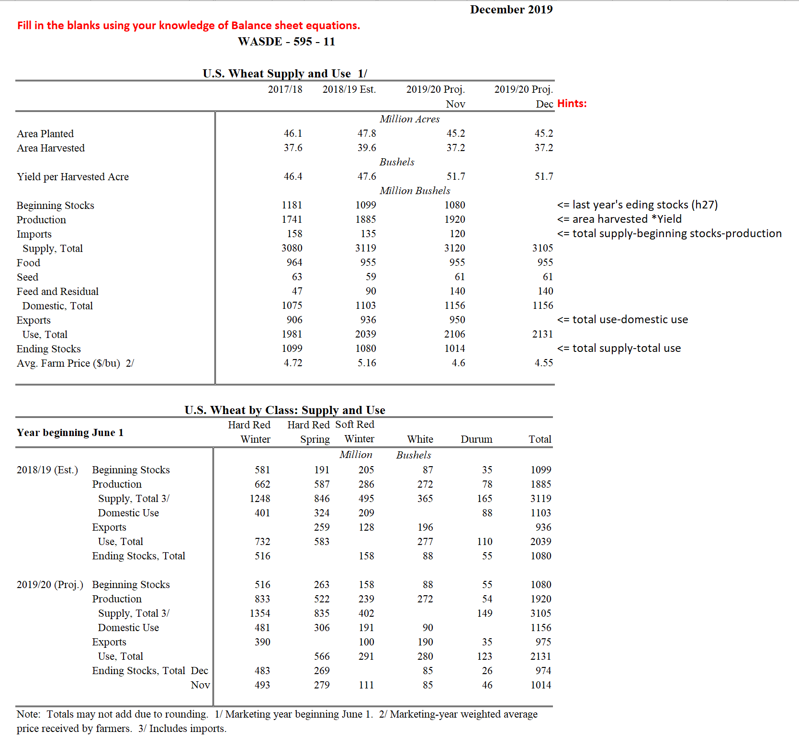
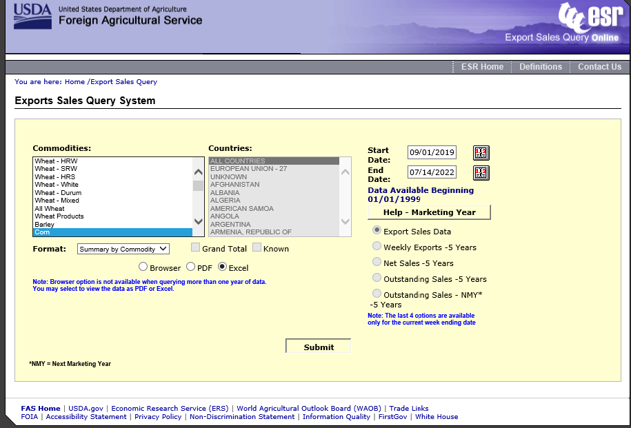
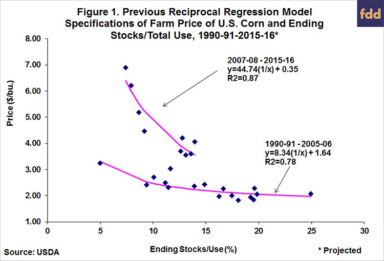
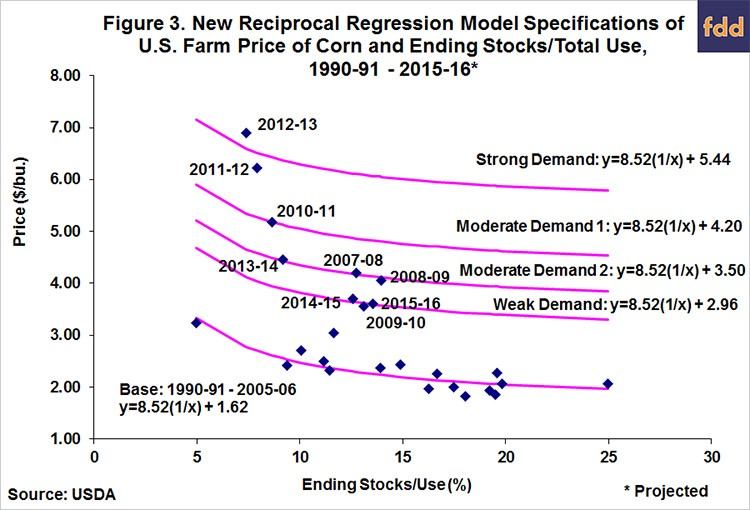

--- 
title: "A Minimal Book Example"
author: |
  Olga Isengildina Massa and Shamar L. Stewart
date: "August 2023"
site: bookdown::bookdown_site
documentclass: book
bibliography: [book.bib, packages.bib]
# url: your book url like https://bookdown.org/yihui/bookdown
cover-image: images/cover.png
description: |
  This is a minimal example of using the bookdown package to write a book.
  The HTML output format for this example is bookdown::gitbook,
  set in the _output.yml file.
link-citations: yes
github-repo: rstudio/bookdown-demo
---

# Preface {-}

This training program is designed to enhance the technical skills and background knowledge of agricultural outlook analysts. This program was developed over 2021-2023 as part of the cooperative agreement between Virginia Tech and Economic Research Service (ERS) of the United States Department of Agriculture (USDA) targeted at enhancing the quality, communication and sustainability of the USDA commodity outlook program. This version focuses on more general materials that would be relevant for outlook analysts around the world and for the State of Maharashtra in India, in particular.

The program covers both conceptual and applied topics focusing on modern tools relevant to agricultural outlook.  We demonstrate various approaches to forecasting and discuss the advantages and pitfalls of these methods.  

## About the Authors {-}

- [Olga Isengildina](https://aaec.vt.edu/people/faculty/Isengildina_Olga.html)
- [Shamar Stewart](https://aaec.vt.edu/people/faculty/Stewart-Shamar.html)

```{r include=FALSE}
# automatically create a bib database for R packages
knitr::write_bib(c(
  .packages(), 'bookdown', 'knitr', 'rmarkdown', 
  'fpp3', 'tidyUSDA' 
), 'packages.bib')
```

<!--chapter:end:index.Rmd-->

# Public Agricultural Outlook Programs: Structure, Role and Impact {#public}

Agricultural markets are characterized by pervasive uncertainty regarding future prices and quantities.  The uncertainty can be attributed largely to a combination of a highly inelastic demand for food and a production technology that is subject to vagaries of nature such as weather, pests, and biological lags.  This combination of factors results in a set of market prices that may vary substantially within a year and from year to year.

The objective of public situation and outlook programs is to facilitate effective decision-making in this uncertain agricultural environment, where effective decision-making is defined as economic actions that result in higher profits, utility, and social welfare than otherwise would occur.  The situation component of public programs is devoted to the production and collection of data, such as crop size, inventories of livestock, and producer acreage intentions.  The outlook component is directed towards interpretation of the data and economic analysis.

Economists believe that public agricultural forecasts help markets work more efficiently, ensuring reliable source of information. These forecasts help avoid the abuse of market power by large companies, leveling the playing field across market participants. Agricultural outlook programs also enable anticipatory policy development by the government.  
It is important to ensure that agricultural forecasts are provided by the government as market information is a public good and will be under-supplied by public sources. However, it is also important to find a balance on what forecasts are provided, how they are prepared and delivered given the technological revolution and shifting boundaries between public and private work.

Public situation and outlook programs have a relatively long history.  For example, the first national meeting generally is thought to be the U.S. Department of Agriculture's Outlook Conference held on April 20, 1923. Since that time, situation and outlook programs have expanded considerably in scope, both at the federal level under the auspices of the U.S. Department of Agriculture (USDA) and at the state level within Land Grant Colleges of Agriculture.  Expenditure on these programs in the US has been substantial. The Office of Management and Budget reported that out of 

>> “6.6 billion in total direct funding for major statistical programs across all Federal agencies in 2012, USDA accounted for about $521 million, or 7.8% of the total” (C-FARE, 2013, p. 4) 

Over 30% of these funds were allocated to the National Agricultural Statistical Service (NASS), an agency primarily responsible for data collection and dissemination.  

Because of their relevance and importance these forecasts sometimes become a center of controversy. One example begins in 1929 when the U.S. Congress singled out cotton in a notable policy restriction.  Apparently, two years earlier, one of USDA’s routine monthly forecasts had projected lower cotton prices.  When this forecast proved accurate, some in the cotton industry assumed that the forecast caused the price decline. This led to a political reaction where the USDA was banned from forecasting (only) cotton prices, a policy that remained in place until the 2008 Farm Bill. 

Another example includes corn futures prices posting their biggest drop in three years after the USDA estimated a bigger-than-expected crop on August 12, 2019, despite floods that slowed planting (Huffstutter and Polansek, 2019). This price drop caused an angry reaction from a farmer who threatened a USDA employee, which prompted USDA to pull its staff from a crop tour.  While this report turned out to be accurate and USDA defended its methods, situations like this demonstrate the importance and the impact of USDA outlook reports.

The materials in this module demonstrate how agricultural outlook programs differ around the world. The first is the presentation by Jennifer Bond and Ann Effland that discusses the history, structure and the changing role of the outlook program in the United States. The US public outlook program is one of the strongest and best funded in the world and serves as a benchmark for other outlook programs.

[](docs/ERS-Outlook History Presentation_adopted.pdf)

Our second example describes the history, changing role and the current approaches used for the public sector forecasting in Australian agriculture.  Just like in the US, the role of the public forecasting system has changed significantly over time due to changing priorities and resources. The current public forecasting system in Australia is much smaller than the US and therefore serves a different function. See ABARES Approach to Forecasting [here](docs/ABARES Approach to Forecasting.pdf).

The similarities, differences and emerging issues in public outlook programs around the world were discussed further in a workshop conducted on October 14, 2020, which was hosted by Olga Isengildina Massa and moderated by Maurice Landes. The speakers included:

- Rohan Nelson, Program Leader, Agricultural Forecasting and Policy | Agriculture and Trade Branch | ABARES, Australia.

- Anastassios Haniotis, Director, DG Agriculture, European Union.

- Stephan Gagne, Deputy Director, Agriculture and Agri-Food Canada, Canada.

- Mark Jekanowski, Chairman, World Agricultural Outlook Board, USDA, USA.

Comments were also provided by Utpal Vasavada, the Associate Direction of the Market and Trade Economics Division, USDA, USA. 

>>Insert workshop recording here

After viewing the workshop recording it is important to reflect and discuss how the issues mentioned in the workshops are similar or different from the situation in your country and the scale and resources available for public agricultural outlook in your case.  How you can learn from the experiences in other countries to build the best possible outlook program that would be most suitable to your situation?


```{block, type = "rmdtip"}
**Reflection Activity**

1.	Have there been recent changes in the outlook program of your agency?  What has been done?  What new products or practices were implemented?
2.	Why?  What issues were addressed? What are the emerging changes in outlook needs?
3.	What resources were required to implement these changes? 
4.	What are the different platforms and timelines for publishing and dissemination?
5.	What staff and training needs had to be addressed to implement these changes?
6.	Are you using USDA outlook products?  How?  Has this changed?
7.	How do you assess commodity outlook information needs?
8.	How do you assess the impact of commodity outlook products?
9.	How do you collect feedback regarding the relevance of existing products?

```


## References {-}

- Huffstutter, P., and Tom Polansek. 2019. “Farmer’s Threat Prompts U.S. Agriculture Department to Pull Staff from Crop Tour.” Available at: https://www.reuters.com/article/us-usa-grainstour- threat-idUSKCN1VB242

- The Council on Food, Agricultural & Resource Economics (C-FARE). (2013). Value of USDA Data Products. Washington, DC.


<!--chapter:end:01-module.Rmd-->

# Agricultural Outlook Tools and Approaches {#outlook}

## Balance Sheet Approach

One of the similarities between various outlook programs around the world is the use of the balance sheet approach for commodity outlook. The most prominent example of the balance sheet forecasts is the World Agricultural Supply and Demand Estimates (WASDE) reports from USDA. These reports cover numerous crops and livestock and are based on separate balance sheets that are maintained for over 90 countries. It is widely considered that these reports serve as benchmark balance sheet estimates for nearly all market participants. 

[WASDE reports](http://www.usda.gov/oce/waob/wasde/wasde.htm) are released monthly 12 times a year and contain marketing year forecasts. Marketing year definitions vary by commodity, such as September -- August for corn and soybeans, June -- May for wheat, August -- July for cotton, January -- December for cattle and December -- January for hogs.  For all commodities, the first forecast is released in May before the marketing year and is finalized about 19 months later. Each month the forecast of the same event (marketing year value) is updated as more information becomes available.  This means that the forecast errors become smaller across the forecasting cycle as more information becomes available. 

There are a number of agencies that participate in the WASDE process.  For example, 

- [Foreign Agriculture Service (FAS)](http://www.fas.usda.gov/): information regarding foreign production, use and trade 

- [Economic Research Service (ERS)](http://www.ers.usda.gov/): identifies important economic effects and implications for prices, quantity supplied and quantity demanded. 

- [Farm Service Agency (FSA)](http://www.fsa.usda.gov/): describes current policy environment and farmers’ reaction to current policies. 

- [Agricultural Marketing Service (AMS)](http://www.ams.usda.gov./): provides current price and marketing reports 

- [World Agricultural Outlook Board (WAOB)](http://www.usda.gov/agency/oce/waob/waob.htm): coordinates the interagency process used to produce WASDE estimates 

### Balance Sheet

A balance sheet is one of the most popular tools used in fundamental analysis of commodity prices. It can be constructed for a particular crop, sector or the entire country. Typically, a construction of a balance sheet starts with building a supply side, followed by consumption, or use, side.  The balance sheet ties both sides together by rationing available supplies to competing uses.  Thus, a balance sheet is a joint system of interrelated forecasts. In a generic balance sheet, total supply is a sum of beginning stocks, production and imports.  Total consumption (use) is a sum of domestic consumption, exports and residual.  Endings stocks is a difference between total supply and total consumption.

## Exercise {-}

The following activity will help you practice your understanding of balance sheet equations described above. 

Using the information presented in the screenshot, complete the relevant line items of the WASDE balance sheet.

[](docs/Balance_sheet_activity.xlsx)


While the balance sheet is a popular tool, it is often combined with and relies upon various other approaches to forecasting. These include time series approaches, futures-based models and other methods that will be discussed in detail later in this training course. But before we get to discussing specific methods, we need to discuss various criteria used for selecting what and how to forecast.

## Forecast selection and evaluation

Nelson et al, 2022a argues that forecast quality is a much broader concept than accuracy. He mentions that forecast quality criteria should include availability, accuracy, timeliness, reliability and relevance, as shown in the figure below.


Source: Cash et al. (2002), Nelson et al, (2022a).

Based on these general criteria, ABARES evaluates the performance of their forecasts from three perspectives: the ability of the system to produce accurate forecasts, the ability of the system to meet changing institutional objectives (see Nelson, 2018), and the value–in–use of its forecasts to diverse end-users (see Nelson et al. (2022b) for details).  This approach echoes the US two-prone system with a focus on what forecasts should be made and how to produce the most credible forecasts.  The first question of what forecasts should be made stems from resource constraints.  Since outlook information is a public good, the public will always request more information as it is distributed free of charge. However, resource limitations force public forecasters to focus on areas of biggest priorities.  The challenge is that determining these biggest priorities may be difficult.  This process boils down to determining forecasts of highest value and is revisited periodically during the times of budget pressures. 

The research report provided below is one of the most recent examples of such efforts.  This report describes both the reasons for providing public agricultural outlook information and the foundation for assessing its value.  The report provides a number of methods that can be used to assess the value of information and provides a framework for prioritizing data products. 

[From Farm Income to Food Consumption: Valuing USDA Data Products](https://static1.squarespace.com/static/598b4450e58c624720903ae6/t/59a768c0f9a61e6c2d049c0f/1504143555758/cfare-data-review-report-1-14-v4.pdf)

After reviewing the report, it is important to reflect and discuss which methods and approaches mentioned in it would be appropriate for prioritizing data products in your situation. The answers to these questions will not be straight forward as political pressures are often present and may dictate what the priorities are regardless of economic reasons.  

The second component of forecast evaluation focuses on concepts of accuracy and efficiency. Academic literature describes a wide variety of methods that have been used to analyze the accuracy and efficiency of USDA forecasts.  Most studies assume that forecasters minimize a symmetric linear or quadratic loss function, mean absolute errors (MAE) and root mean squared errors (RMSE) are the standard measures of accuracy reflecting the magnitude of forecast errors. Only one study by Bora, Katchova and Kuethe (2020) explored the possibility of asymmetric loss functions for USDA forecast providers with different weights placed on over or under-prediction. 

While most studies evaluate forecasts as published values, some (e.g., Isengildina, MacDonald and Xie, 2012) express forecasts as percent changes from previous year’s values. The evaluation of accuracy typically focuses on forecast errors measured as the difference between the realized value and the predicted value and expressed in either raw units or percentages or log percentages to control for changes in levels of the forecasted variable over time.  These measures are typically used to compare the accuracy of forecasts in question to a certain benchmark, such as naïve forecast (using Theil’s U statistic), or a time-series forecast, or another alternative forecast. Modified Diebold Mariano test (Harvey, Leybourne, and  Newbold, 1997) is typically used to determine whether the difference between the accuracy of two alternative forecasts is significantly different from zero. The results of this evaluation would indicate which forecast is more accurate relative to the included alternative. 

Most of the previous studies conduct accuracy evaluation at each forecast horizon, as fixed-event forecasts are expected to become more accurate across the forecasting cycle as more information becomes available.  Some recent studies proposed methods to compare the relative accuracy of path forecasts (e.g., Patton and Timmerman, 2012).  For example, Bora, Katchova, and Kuethe (2022) use the tests of multi-horizon superior predictive ability proposed by Quaedvlieg (2021) that jointly consider all horizons along the entire projection path. These tests evaluate the average superior predictive ability for a path forecast with larger loss at some horizons that is compensated by superior performance at other horizons when compared to the alternative path forecast.

Some studies (e.g., Isengildina, MacDonald and Xie, 2012) also used a directional accuracy test developed by Henriksson and Merton (1981). The test is based on 2 x 2 contingency tables, reflecting the direction of year-to-year change in each variable forecast for each stage’s average forecast. The frequency with which forecasts and actual realizations of the variable decrease or increase together is compared with the expected frequency of independent directional changes using a Chi-squared statistic.  The results of this evaluation reflect a proportion of time the forecast correctly predicts the directional change in the realized value. 
Theil (1958) developed the original the framework for rolling-event forecast efficiency testing, which was extended by Mincer and Zarnowitz (1969). Nordhaus (1987) introduced the utilization of these tests into a fixed-event framework, and Clements (1997) extended this to the pooling of rolling sets of fixed-event forecasts. The fundamental measures of optimal forecasts are bias and efficiency (Diebold and Lopez, 1998). 

Tests of bias examine whether positive and negative forecast errors cancel out and the average forecast errors equal zero. Traditionally, this condition has been tested with a simple t-test, but some studies have applied a regression-based test of bias developed by Holden and Peel (1990), in which the error is regressed against a constant.  The benefit of this approach is that it allows for heteroscedasticity and autocorrelation correction of standard errors following Newey and West (1987). Variations of this test include a trend variable to assess whether bias has changed over time. Other studies (e.g., Sanders and Manfredo, 2007) have applied what is widely known as a Mincer-Zarnowitz equation to assessing forecast bias.  In this approach a realized value is regressed against the constant, the forecast and the error term. This regression tests whether forecasts are unbiased (coefficient for constant is zero) and properly scaled (coefficient for forecast is one). However, estimation of this equation may encounter statistical challenges, especially when there is lack of stationarity in either realized values or forecasts. 

Tests of weak-form efficiency typically examine whether forecast errors are orthogonal to forecasts themselves and prior forecast errors (e.g., Sanders and Manfredo, 2002, 2003; Isengildina, MacDonald and Xie, 2012).  Some studies also assessed orthogonality to other information available at the time the forecasts are made (e.g. Isengildina-Massa, Karali, and Irwin, 2013).  Studies also assessed changes in forecast accuracy over time (e.g., Bailey and Brorsen, 1998; Sanders and Manfredo, 2003; Isengildina, MacDonald and Xie, 2012) by regressing absolute forecast errors against a constant and a time trend. Fixed-event forecast errors should also demonstrate a pattern of errors decreasing across the forecast horizon as more information becomes available (e.g., Isengildina-Massa, Karali, and Irwin, 2013; Isengildina, MacDonald and Xie, 2012).

Weak form efficiency of fixed-event forecasts also implies independence of forecast revisions (Nordhaus, 1987). According to Nordhaus, if forecasts are weak form efficient, revisions should follow a random walk.  This condition has been tested extensively in previous studies by Isengildina, Irwin and Good (2006), Sanders, Altman, and Manfredo (2009), Isengildina, Irwin and Good (2013), Isengildina, MacDonald and Xie (2012), MacDonald and Ash (2016), and MacDonald, Ash and Cooke (2017), among others. However, the interpretation of this test results has changed over time.  While some earlier studies (Isengildina, Irwin and Good, 2006; Sanders, Altman, Manfredo, and Anderson, 2009; Isengildina, Irwin and Good, 2013; Isengildina, MacDonald and Xie, 2012) interpreted evidence of correlation in forecast revisions as “smoothing,” suggesting of strategic behavior of forecast providers, Goyal and Adjemian (2023) argued that correlated revisions may also be explained by information rigidities that cause forecasts to be infrequently or only partially updated. The authors apply a framework developed by Coibion and Gorodnichenko (2015) to demonstrate that information rigidities are the most likely cause of correlations in crop production revisions due to production and yield data that is either too costly to obtain or too noisy.

Numerous studies demonstrated that combination forecasts provide accuracy benefits (e.g., Colino and Irwin, 2010; Colino, Irwin, and Garcia, 2012, Hoffman et al, 2015).  A related test developed by Harvey, Leybourne and Newbold (1998) assesses forecast encompassing. If a preferred forecast encompasses an alternative forecast, then the alternative forecast provides no useful information beyond that provided in the preferred forecast. This test is based on a regression used to evaluate the covariance between the preferred forecast error series (dependent variable) and the difference between the preferred and alternative forecast error series (independent variable). If this covariance is zero, the preferred forecast is said to encompass the competing one. This test has been used extensively to demonstrate whether additional information, such as time series forecasts (e.g. Sanders and Manfredo, 2003), or futures-based forecasts (e.g, Hoffman et al, 2015; Colino and Irwin, 2010) may help improve USDA forecasts.

As most USDA forecasts are released at multiple horizons (several months, quarters or years, another important criterion for their evaluation is informational content. Earlier studies (e.g., Sanders and Manfredo, 2008) used the direct test developed by Vuchelen and Gutierrez (2005). for evaluation of information content across multiple horizons. This test establishes the contribution of longer-horizon forecasts relative to the information contained in shorter-horizon forecasts.  More recent studies (e.g., Luke and Tonsor, 2023; Bora, Katchova, and Kuethe, 2022) used the test developed by Breitung and Knuppel (2021) to determine the maximum informative projection horizon by comparing the projections’ mean-squared prediction errors to the variance of the evaluation sample. The benefit of this test is that it circumvents the need to compare projections to naïve benchmarks and instead compares prediction errors to the variance of realized values.

As some USDA forecasts are released as part of joint system (e.g. WASDE forecasts, farm income forecasts), it is important to consider the joint accuracy of the system and interaction of various components within a system. Only a few studies addressed these issues. For example, Isengildina-Massa et al, 2021, used a test developed by Sinclair, Stekler, and Carnow (2015) which combines the single accuracy measure for each component of the joint forecasts into a vector. Specifically, it focuses on the difference (Mahalanobis distance) between the mean vectors of forecasts and outcomes while allowing for scale differences across different variables and a nonzero correlation between variables. The rationale behind this test is that if a vector of forecasts is similar to the vector of the outcomes, it can be substituted for the actual data for decision making.

The interaction of various components is usually determined through evaluation of the residual variable (ending stocks for WASDE, or Net Cash Income or Net Farm Income for farm income) and determination of the contribution of errors in various components of the balance sheet (or income statement) to the errors in the residual variable. Most studies have approached it using regression or correlation analysis (e.g., Botto et al, 2006; Isengildina-Massa, Karali, Irwin, 2013; Isengildina-Massa et al, 2019).  Recently, Goyal et al, 2023 proposed the use of machine learning methods to decompose USDA ending stocks errors to avoid the issues of multicollinearity inherent in regression analysis used for this purpose. The authors use extreme gradient boosting trees to determine the relative importance of each component of the balance sheet.  Additionally, Goyal et al, 2023, use Shapley additive explanations (SHAP) values (Lundberg and Lee, 2017) to quantify the extent to which ending stocks prediction error increases or decreases from the average prediction error due to the inclusion of a given predictor variable. 

Finally, it is important to note that all of the above methods have been developed and applied to point forecasts, which is how most of the USDA projections are published.  Only price forecasts have been published as ranges until 2019. Most of the early studies reduced these ranges to their midpoint for evaluation, with some exceptions. Sanders and Manfredo (2003) were the first to calculate “hit rates,” the proportion of time the forecast interval contained the final value. Isengildina, Irwin and Good, (2004) applied Christoffersen’s (1998) unconditional coverage test to determine whether forecast hit rates was significantly different from the implied confidence level. Isengildina-Massa and Sharp (2012) extended this analysis to account for asymmetry in forecast errors.  A number of studies (e.g, Adjemian, Bruno, and Robe, 2020; Trujillo-Barrera, Garcia, Mallory, 2016; Isengildina-Massa, Irwin, and Good, 2010, 2011) proposed various methods of improving USDA price forecast intervals.

One of the most important aspects of forecast evaluation is data availability.  Forecasting agencies around the world (e.g., [Farm Income and Wealth Statistics Forecast and Estimate Data Archive](https://www.ers.usda.gov/data-products/farm-income-and-wealth-statistics/), and Cameron and Nelson, 2022) have made extensive efforts to enable users to evaluate the accuracy of their forecasts by providing historical databases of their projections and realized values. This process helps ensure transparency and communication between forecast providers and data users.

Historical databases are also necessary for computing forecasts, as most of them are based on patterns in the data over time.  The following modules will describe the use of `R` codes for data manipulation and computation of various forecasts relevant for modern agricultural outlook. We will illustrate coding and forecasting concepts using US forecasts due to data availability, but these concepts can be applied to Maharashtra's data in a similar manner. Modules \@ref(data) -- \@ref(stocks-use) describe various forecasting approaches and Module \@ref(accuracy) will focus on forecast accuracy evaluations.

## References

- Nelson, R., A. Cameron, C. Xia, and P. Gooday. 2022a. “The ABARES Approach to Forecasting Agricultural Commodity Markets – Description and Design Choices.” Australian Agribusiness Review 30, 6, ISSN: 1883-5675.

- Cash, D., Clark, W.C., Alcock, F., Dickson, N.M., Eckley, N. and Jäger, J. (2002), Salience, Credibility, Legitimacy and Boundaries: Linking Research, Assessment and Decision Making, John F Kennedy School of Government Faculty Research Working Papers Series RWP02-046. Harvard University, Cambridge.

- Nelson, R. (2018), ‘The future of public sector forecasting in Australian agriculture’, Australasian Agribusiness Perspectives 21, paper 16.

- Nelson, R., Cameron, A., Xia, C., Howden, M. and Miller, M. (2022b), The Australian Agricultural Forecasting System - System Documentation, Technical Report 22.02. Australian Bureau of Agricultural and Resource Economics and Sciences, Canberra.

- Bora, S.S., A.L. Katchova, and T.H. Kuethe.  2020. “The Rationality of USDA Forecasts under Multivariate Asymmetric Loss.” American Journal of Agricultural Economics 103(3): 1006-1033.

- Isengildina-Massa, O., S. MacDonald, and R. Xie. 2012. “A comprehensive Evaluation of USDA Cotton Forecasts.” Journal of Agricultural and Resource Economics 37(1):98-113.

- Harvey, D., Leybourne, S., & Newbold, P. (1997). Testing the equality of prediction mean squared errors. International Journal of forecasting, 13(2), 281–291. doi: 10.1016/S01692070(96)007194

- Patton, A. and Timmermann, A. (2007). “Properties of Optimal Forecasts under Asymmetric Loss and Nonlinearity. Journal of Econometrics, 140:884–918.

- Quaedvlieg, Rogier. 2021. “Multi-Horizon Forecast Comparison.” Journal of Business & Economic Statistics 39: 40–53.

- Bora, Siddhartha S., Ani L. Katchova, and Todd H. Kuethe. 2022. “The Accuracy and Informativeness of Agricultural Baselines.” American Journal of Agricultural Economics, DOI: 10.1111/ajae.12350

- Henriksson, R. D. and R. C. Merton. “On Market Timing and Investment Performance. II. Statistical Procedures for Evaluating Forecasting Skills.” Journal of Business 54(1981):513–533.

- Theil, H. 1958. Economic Forecasts and Policy. Amsterdam: North-Holland Publishing Co.

- Mincer, J. A. and V. Zarnowitz. “The Evaluation of Economic Forecasts.” In J. A. Mincer,ed., Economic Forecasts and Expectations: Analysis of Forecasting Behavior and Performance, Washington, DC: National Bureau of Economic Research, 1969, 1–46.

- Nordhaus, W. D. “Forecasting Efficiency: Concepts and Applications.” The Review of Economics and Statistics 69(1987):667–674.

- Clements, M. P. 1997. “Evaluating the Rationality of Fixed-Event Forecasts.” Journal of Forecasting 16: 225–239.

- Diebold, F. X. and J. A. Lopez. “Forecasting Evaluation and Combination.” In G. S. Maddala and C. R. Rao, eds., Handbook of Statistics 14: Statistical Methods in Finance, Amsterdam: North-Holland, 1998, 241–268.

- Holden, K. and Peel, D. A. (1990). “On Testing for Unbiasedness and Efficiency of Forecasts.” Manchester School, 58:120–127.

- Newey, W. K., and K. D. West. 1987. “A Simple, Positive Semi-Definite, Heteroskedasticity and Autocorrelation.” Econometrica 55: 703–8.

- Sanders, D. and Manfredo, M. (2007). “Rationality of U.S. Department of Agriculture Livestock Price Forecasts: A Unified Approach.” Journal of Agricultural and Applied Economics 39(1): 75-85.

- Sanders, D. R. and M. R. Manfredo. (2002). “USDA Production Forecasts for Pork, Beef, and Broilers: An Evaluation.” Journal of Agricultural and Resource Economics 27:114–128.

- Sanders, D. and Manfredo, M. (2003). “USDA Livestock Price Forecasts: A Comprehensive Evaluation.” Journal of Agricultural and Resource Economics, 28:316–336.

- Isengildina-Massa, O., B. Karali, and S.H. Irwin. 2013. “When Do the USDA Forecasters Make Mistakes?” Applied Economics 45(36):5086-5103.

- Bailey, D. and Brorsen, B. 1998. “Trends in the Accuracy of USDA Production forecasts for Beef and Pork”. Journal of Agricultural and Resource Economics, 23:515–526.

- Isengildina, O., S.H. Irwin, and D.L. Good. 2006. “Are Revisions to USDA Crop Production Forecasts Smoothed?” American Journal of Agricultural Economics 88(4):1091-1104.

- Sanders, D.R., I.J. Altman, M.R. Manfredo, and R. Anderson. 2009. “Using USDA Production Forecasts: Adjusting for Smoothing.” Journal of ASFMRA, 134-142.

- Isengildina, O., S.H. Irwin, and D.L. Good. 2013. “Do Big Crops Get Bigger and Small Crops Get Smaller? Further Evidence on Smoothing in USDA Forecasts.” Journal of Agricultural and Applied Economics 45(1):95-107.

- MacDonald, S. and M. Ash. 2016. “Detecting the Sources of Information Rigidity: Analyzing Forecast Bias and Smoothing in USDA’s Soybean Forecasts.” AAEA paper. (https://ageconsearch.umn.edu/record/235349)

- MacDonald, S., M. Ash and B. Cooke. 2017. “The Evolution of Inefficiency in USDA’s Forecasts of U.S. and World Soybean Markets.” MPRA Paper No. 87545 (https://mpra.ub.uni-muenchen.de/87545/)

- Goyal, R., and M.K. Adjemian. 2023. “Information Rigidities in USDA Crop Production Forecasts.” American Journal of Agricultural Economics, in press, doi.org/10.1111/ajae.12373.

- Coibion, O., and Y. Gorodnichenko. 2015. “Information rigidity and the expectations formation process: a simple framework and new facts.” American Economic Review. https://doi.org/10.1257/aer.20110306

- Colino, E.V., and S.H. Irwin. 2010. “Outlook vs. Futures: Three Decades of Evidence in Hog and Cattle Markets.” American Journal of Agricultural Economics, 92(1): 1-15.

- Colino, E.V., S.H. Irwin, and P. Garcia. 2012. “Improving the Accuracy of Outlook Price Forecasts.” Agricultural Economics 42: 357-371.

- Hoffman, L.A., X.L. Etienne, S.H. Irwin, E.V. Colino, and J.I. Toasa. 2015. “Forecast Performance of WASDE Price Projections for U.S. Corn.” Agricultural Economics 46(S1):157-171.

- Harvey, D. I., Leybourne, S. J., & Newbold, P. (1998). Tests for forecast encompassing. Journal of Business & Economic Statistics, 16(2), 254–259. doi: 10.1080/07350015.1998.10524759

- Sanders, D. and Manfredo, M. (2008). “Multiple Horizons and Information in USDA production forecasts.” Agribusiness, 24(1):55-66.

- Vuchelen, J., & Gutierrez, M.-I. (2005). A direct test of the information content of the OECD growth forecasts. International Journal of Forecasting, 21, 103–117.

- Luke, J.R., and G.T. Tonsor. 2023. “USDA Long-Term Meat Trade Projections: A Comprehensive Evaluation.” Journal of Agricultural and Applied Economics, DOI:10.1017/aae.2023.13.

- Breitung, EvJrg, and Malte Knüppel. 2021. “How Far Can We Forecast? Statistical Tests of the Predictive Content.” Journal of Applied Econometrics 36: 369–92.

- Isengildina-Massa, O., Karali, B., Kuethe, T. H., and Katchova, A. L. (2021). “Joint Evaluation of the System of USDA’s Farm Income Forecasts.” Applied Economic Perspectives and Policy, 43(3):1140–1160.

- Sinclair, T.M., H.O. Stekler, and W. Carnow. 2015. Evaluating a Vector of the Fed’s Forecasts. International Journal of Forecasting 31: 157–164.

- Botto, A.C., O. Isengildina, S.H. Irwin, and D.L. Good. 2006. “Accuracy Trends and Sources of Forecast Errors in WASDE Balance Sheet Categories for Corn and Soybeans.” American and Applied Economics Association Annual Meeting, Long Beach, CA, July 23-26, 2006.

- Isengildina-Massa, O., Karali, B., Kuethe, T. H., and Katchova, A. L. 2019.  “Sources of Errors in USDA’s Net Cash Income Forecasts”. NCCC-134 paper. (https://ageconsearch.umn.edu/record/309630/?ln=en).

- Goyal, R. M.K.Adjenian, J. Glauber, and S. Meyer. 2023. “Decomposing USDA Ending Stocks Forecast Errors.” Journal of Agricultural and Resource Economics, ISSN: 1068-5502 (Print); 2327-8285 (Online) doi: 10.22004/ag.econ.320674

- Lundberg, S.M., and S.-I. Lee. 2017. “A unified approach to interpreting model predictions.” Advances in Neural Information Processing Systems 4765-4774. Accessed at:https://doi.org/10.48550/arXiv.1705.07874

- Isengildina, O., S.H. Irwin, and D.L. Good. 2004. “Evaluation of USDA Interval Forecasts of Corn and Soybean Prices.” American Journal of Agricultural Economics 86(4):990-1004.

- Christoffersen,P.F. “Evaluating Interval Forecasts.” International Economic Review 39(1998):841–62.
Isengildina‐Massa, O., and J.L. Sharp. 2012. “Evaluation of USDA Interval Forecasts Revisited: Asymmetry and Accuracy of Corn, Soybean, and Wheat Prices.” Agribusiness 28(3):310-323.

- Adjemian, M.K., V.G. Bruno, and M.A. Robe. 2020. “Incorporating Uncertainty into USDA Commodity Price Forecasts.” American Journal of Agricultural Economics 102(2):696-712.

- Trujillo-Barrera, A, Garcia, P., and Mallory, M.L. 2016. “Price Density Forecasts in the U.S. Hog Markets: Composite Procedures.” American Journal of Agricultural Economics  98(5): 1529-1544.

- Isengildina-Massa, O., S.H. Irwin, and D.L. Good. 2010. “Quantile Regression Estimates of Confidence Intervals for WASDE Price Forecasts.” Journal of Agricultural and Resource Economics 35(3):545-567.

- Isengildina-Massa, O., S.H. Irwin, D.L. Good, and L. Massa. 2011. “Empirical Confidence Intervals for USDA Commodity Price Forecasts.” Applied Economics 43(26):3789-3803.

- Cameron, A., and R. Nelson. 2022. “Enabling Users to Evaluate the Accuracy of ABARES Agricultural Forecasts.” Australian Agribusiness Review, 30,7, ISSN: 1883-5675.


<!--chapter:end:02-module.Rmd-->

# Data Manipulation, Visualization, and Basic Forecasting {#data}

In this module, we will focus on importing, manipulating, and visualizing time series data in R. Towards the end, we will estimate and graph the forecasts of a few basic time series models. 

For much of our exercises, we will focus on importing data from the [USDA's NASS QuickStat database](https://quickstats.nass.usda.gov/).

## Optional Materials {-}

While these modules are intended to be self-contained, they also builds on the [MTED-R-Training Workshop from the USDA](https://usda-ers.github.io/MTED-R-Training/){target="_blank"}. It would be a worthwhile exercise to review the `R` basics, Data Importation, and Data Transformation modules. This would prove especially useful for the new(er) users to `R`.

## NASS QuickStats

The US Department of Agriculture (USDA)'s National Agricultural Statistical Agency (NASS) has an `R` package called `tidyUSDA` that connect directly to an API and allow users to download QuickStats data into R [(See MTED-R-Training)](https://usda-ers.github.io/MTED-R-Training/chp1/mod2/import-and-export-data.html#import-nass-quickstats-data-optional). 

Additionally, `tidyUSDA` gives you the option to explore the QuickStats data at either the county or national level. This allows you to quickly visualize data for report generation.

In this example, we will use an API to pull the `Corn GRAIN - PRICE RECEIVED, MEASURED in $ / BU` data series into R. Our ultimate goal is to explore the data and perform some basic forecasting.

We will reserve the appropriateness of these models for later modules.

### `tidyUSDA` package

If you have never done so before, you will need to install the `tidyUSDA` package. You can achieve this using the syntax below. We suggest running this code in your **console** and not scripts. You need only install this package once.

```{r install.USDA, eval=FALSE}
install.packages("tidyUSDA")
```

In subsequent sessions you can simply call the library into memory.

```{r tidylib, eval = FALSE}
library(tidyUSDA)
```

### API Key

In order to pull data directly into `R`, you will need an API key. Please [click here](https://quickstats.nass.usda.gov/api) to obtain a free API Key via email. Return to this page once you have been issued a key.

Now that you have obtained your API Key, you can supply it to `R` for use in this and subsequent sessions. There are two approaches you could take:

- Approach 1: You could hard code your key (Not Recommended). 

```{r, eval = FALSE}
key <- "PUT-YOUR-KEY-HERE"
```

If you R scripts will be public facing, this might not be a desirable option.

- Approach 2: Using the `keyring` package

To help with protecting your API Key we will use the `keyring` package. **You might need to install the `keyring` package first. You can repeat the same step from earlier to get this done.**

```{r setkey, eval = FALSE}
# Load the Keyring package
library(keyring)

# Save the API Key (you can skip this step in the future)
#tidyUSDA is the nickname assigned for my API key combination
key_set("tidyUSDA")

```

A password prompt should now appear. Enter your API key and click `OK`.


For this and future sessions, you can use the `key_get` command to retrieve the key. To do so, run the following line

```{r getkey}
key <- keyring::key_get("tidyusda")
```

We can determine the relevant parameters for our search by visiting the [Quickstat website](https://quickstats.nass.usda.gov/). 

We are ready to pull the `Corn GRAIN - PRICE RECEIVED, MEASURED in $ / BU` data. 

### Writing a Query {#query}

```{r pullcorn}
corn <- tidyUSDA::getQuickstat(
  key = key,
  program = "SURVEY",
  sector = "CROPS",
  group = "FIELD CROPS",
  commodity = "CORN",
  category = "PRICE RECEIVED",
  data_item = "CORN, GRAIN - PRICE RECEIVED, MEASURED in $ / BU",
  domain = "TOTAL",
  geographic_level = "NATIONAL",
  state = "US TOTAL",
#Must specify years as character variables 
  year = as.character(c(1990:2019))
)
```

We have a number of approaches to be able to see the full data. First, we can call the variable name in `R`.^[We will suppress the results here to conserve on space.]

```{r, eval=FALSE}
corn
```

You can use the `View()` command to explore the dataset in your `R` environment.

```{r, eval = FALSE}
View(corn)
```

Alternatively, we can view the head (first `n` observations). `R` will default to `n = 6`.

```{r}
head(corn, 10)
```

## Data Manipulation
### Subseting & Filtering

Much of our data manipulations can be performed quickly (and efficiently) using the `tidyverse` environment. The `tidyverse` package is very powerful and speeds up the data cleaning and manipulation process. 

Unfortunately, much of the functionalities we require are missing from the package of the same name.

For our purpose and given our focus on time series, we will use the `fpp3` package that accompanies the free text [Forecasting: Principles and Practice (3rd ed) by Rob J Hyndman and George Athanasopoulos](otexts.com/fpp3/). This package builds on the `tidyverse`/`dplyr` packages and a number of packages dedicated to time series models.

This would be a good time to install the `fpp3` package.

```{r fpp3, eval = FALSE}
install.packages("fpp3")  
```

Since there are so many columns we can drop all irrelevant columns. For our purposes assume further that we need to get the price data at the `annual (YEAR)` frequency.

It might prove easier if we were to first `filter` the data on the `reference_period_desc` column. We will keep only the rows that meet the criterion of `reference_period_desc == "YEAR"`

```{r}
library(fpp3)
# View the column names
colnames(corn)

# Keep only the yearly prices
corn.annual <- filter(corn,
                      reference_period_desc == "YEAR")
```

Next, we would like to keep only the relevant columns. To do so, we can use the `select()` function to drop all columns **except** `year` and `Value`.

```{r}
# Keep the "year" and "Value" columns
corn.annual2 <- select(corn.annual, year, Value)
corn.annual2
```

Now, we can declare the `year` as our time index.

```{r}
corn.ts <- as_tsibble(corn.annual2, index = "year")
corn.ts
```

Notice now that the `corn.ts` series is now a `tsibble` object arranged in chronological order (on the `year` column).

---
### Pipe Operator

You can imagine how cumbersome our code will get as we start to perform multiple operations on our raw dataset. We will need to save the intermediary dataframes along the way. Our variable names could quickly become long and confusing.

To get around this, we can use the pipe operator, `%>%`. This allows us to pass arguments (think intermediary dataframes) from left to right and perform various functions/operations at each stage. For simplicity, we will utilize this function extensively throughout this training module.

Revisiting the problem above, we can recreate `corn.ts` in a single line of code. We will store the results in an aptly named variable, `corn.ts.pipe`.

```{r}
corn.ts.pipe <- corn %>% 
  filter(reference_period_desc == "YEAR") %>% 
  select(year, Value) %>% 
  as_tsibble(index = "year")
corn.ts.pipe
```

If you are skeptical, you can check whether **all** (pairwise) elements in both `tsibble` objects are the same:

```{r}
identical(corn.ts, corn.ts.pipe)
```

88888 As a shortcut, you can insert the pipe operator using the following syntax:
  - Windows: CTRL + SHIFT + M
  - Mac: COMMAND + SHIFT + M
  
## Visualizing Time Series Data

### Time plot

We are ready to create our first time series plot. We will use the `autoplot()` command from the `fpp3` package. For those familiar with the `ggplot` environment, the syntax is very similar.

```{r}
corn.ts %>% autoplot(Value, col = "blue") + 
  labs(title = "Annual Corn Prices Received",
        y = "$/bu", 
       x= "Year",
       caption = "Source: NASS QuickStat") + theme_bw()
```

The argument `theme_bw()` is optional. It was used to change the presentation of the graph and gridlines. You can change yours to other default options such as `theme_classic()`, `theme_minimal()` or even a user-defined customized theme.

8888
Try removing the `+ theme_bw()` portion of your code to see what the results now look like.

### Walkthrough Exercise {-}

Let us return to the [Writing a Query Section](\@query). 

1. Instead of annual data, get the monthly corn prices. 

- It is easiest to filter rows where `freq_desc=="MONTHLY"`
- Keep only the `year`, `reference_period_desc`, and `values` column. 

2. We will declare the data as a `tsibble` object. This will require some work though to allow `R` to recognize we have a `yearmonth` variable. You can use the `paste0` function to first create a variable that combines both the `year` and `reference_period_desc` columns. 

3. Store your variable as `corn.monthly` and drop all irrelevant columns.

4. Be sure to use the pipe operator to achieve Tasks 1 -- 3 in a single step.

5. Now produce an `autoplot` of `corn.monthly`. Be sure to add appropriate labels.

#### Solution {-}

```{r, warning=FALSE}
corn.monthly <- corn %>% 
  # Keep only the Months
  filter(freq_desc== "MONTHLY") %>%
# Keep only the year, reference_period_desc, and Value columns
  select(year, reference_period_desc, Value) %>% 
# Create a yearmonth object
  mutate(date = yearmonth(paste0(year, reference_period_desc))) %>% 
# declare date as index
  as_tsibble(index = date) %>% 
# Keep only the date and Value column
  select(date, Value)

corn.monthly %>% autoplot(Value, col = "darkblue") + 
  labs(title = "Monthly Corn Prices",
       y = "$/bu") +
  theme_bw()
```

```{block, type = "rmdtip"}

- Are you able to identify any unique features in this data? Is it trending for example, do we observe seasonality? etc.

- How could you forecast this series?

In the ensuing sections, we will explore the properties of `corn.monthly` a bit closer.

```

### Visualizing corn.monthly (further) {#viz}

A researcher might be potentially concerned about seasonality in prices received. We have several *graphical* tools at our disposal to explore this a bit further.

#### Subseriesplots

```{r}
corn.monthly %>% gg_subseries(Value) + 
  labs(title = "Subseries Plot", y = "") + 
  theme_bw()
```

The `gg_subseriesplot` command creates a plot of our corn price data grouped by month (across all years). The blue lines correspond to each monthly average. 

From these graphs we do not observe the presence of strong seasonality in the price data.

#### Seasonplots

If we would like to see the time plot of the data against the seasons (months) instead, we can use the `gg_season` command. In fact, this is usually a good way to identify years that were potential outliers.

```{r}
corn.monthly %>% 
  gg_season(Value, labels = "both") +
  labs(title = "Seasonal Plot of Corn Prices") + 
  theme_bw()
```
The `year.labels = "both"` argument adds the year labels to the graph (on both sides) instead of in a legend. It is particularly useful in our case since the colors quickly get confusing with so many years.

Adding the argument `polar = TRUE` to the `gg_season` function produces a variation using polar coordinates. Adding this option makes the time series axis circular rather than horizontal.

```{r}
corn.monthly %>% gg_season(Value, polar = TRUE, 
                           labels = "both") + 
  labs(title = "Seasonal Plot of Corn Prices") + 
  theme_bw()
```

In general, the summary of the seasonal plot above matches the `autoplot` earlier. We observe that:

- In the earlier periods, the values across months were closer (less volatile) than in later periods. 

- On average, prices between 2010 and 2015 were higher than the remaining periods. 

- 2015 to 2019 saw a temperance of prices, albeit higher than the beginning of the sample.


#### Autocorrelation (ACF) Plot

Correlation, as a statistical concept, measures the degree of a **linear** relationship between two variables.

Autocorrelation, on the other hand, measures the **linear** relationship between a variable and its lagged (past) values. The higher the correlation (positive or negative) between our variable, $y_t$ and its lags $y_{t-k}$ where $k = 1, \ldots, T$, the closer the correlation coefficient is to $\pm 1$

```{r}
corn.monthly %>% ACF(Value, lag_max = 36) %>% 
  autoplot() + 
  labs(title = "ACF: Monthly Corn Prices") + 
  theme_bw()
  
```

The value of `r ((corn.monthly %>% ACF(Value))$acf %>% round(3))[2]` at lag 1 implies that last month's corn price explains more than `r (((corn.monthly %>% ACF(Value))$acf %>% round(3))[2])^2*100`% of the current corn price.^[The correlation stats squared.] The correlation value slowly goes to zero as we go further back in time. This indicates that we have a series with a trend. We will discuss further later.

To view the correlation statistic at each lag, you can copy and paste the code below.

```{r}
corn.monthly %>% ACF(Value) 
```

## Benchmark Forecasting Methods

```{r, echo = FALSE}
corn.monthly %>% autoplot(Value) + 
  labs(title = "Monthly Corn Prices", y = "$/bu") + theme_bw()
```

Given our graph above, how could you go about forecasting the corn prices for the next 3 years ($h = 36$)?

Below, we will discuss some of the most basic (benchmark) models that are often considered when doing outlook forecasting.

### Mean Method

A potential model could be to set our forecast equivalent to the mean of the historical series.

```{r}
# The forecast horizon (h) = 36 or 3 years
corn.mean <- corn.monthly %>% 
  #Specify the model and give it a name (Optional)
  model(meanf = MEAN(Value)) %>% 
  # Specify the horizon
  forecast(h = "3 years")

corn.mean %>% head()
```

You should note that the forecasts produced and stored in `corn.mean` have prediction intervals assigned to them. In this case, it is unspectacular as there is no true uncertainty in our forecasts since we are making projections at the historical mean of the data. Unsurprisingly, all the forecasts are equal to the mean of the data.

```{r}
mean(corn.monthly$Value)
```
We can now visualize the data along with the mean forecasts.

```{r}

corn.mean %>% autoplot(corn.monthly, color = "red",
                       level = NULL) + 
  theme_bw()
```

The `level = NULL` argument turns off the prediction Intervals (PI) associated with each point in our forecast. If it were omitted, we have

```{r}
corn.mean %>% autoplot(corn.monthly, 
                       color = "red",
                       size = 1) + 
  labs(title = "Mean Forecast",
       subtitle = "Corn (Monthly)") +
  theme_bw()
```

### Naïve Method

Another useful method could be to set the forecasts equal to the **last observed value**. 

```{r}
# Looking at the last 6 values
tail(corn.monthly$Value)

#Last value
last(corn.monthly$Value)
```

This is especially true if we believe in the Efficient Market hypothesis and in cases where the market is exceptionally volatile or even mean reverting.

```{r}
# The forecast horizon (h) = 36 or 3 years
corn.naive <- corn.monthly %>% 
  model(naive = NAIVE(Value)) %>% forecast(h = "3 years")

corn.naive
```

Notice here that the forecasts for all future periods are set to the last observed value, `r last(corn.monthly$Value)`

Visualizing the data and the forecasts

```{r}
# plot the forecasts stored in corn.naive
corn.naive %>% autoplot(corn.monthly, 
                        color = "purple", 
                        size = 1)  + 
  labs(title = "Naïve Forecast",
       subtitle = "Corn (Monthly)") +
  theme_bw()
```

```{block, type = "rmdnote"}

Notice that despite setting the forecasts all equal to the last value, the uncertainty around our predictions (as shown by the PIs) is increasing as we go further into the future.

```

### Seasonal Naïve Method

If we assume that the series displays seasonality, we could use a **seasonal naïve method**. The forecast for a given season (say January 2020 and February 2020) is equal to the last value observed for that same season (January 2019 and February 2019, respectively, in this case).

```{r}
# The forecast horizon (h) = 36 or 3 years
corn.snaive <- corn.monthly %>% 
  model(snaive = SNAIVE(Value)) %>% 
  forecast(h = "3 years")

corn.snaive
```

```{r}
# plot the forecasts stored in corn.snaive
corn.snaive %>% autoplot(corn.monthly,
                         color = "darkgreen",
                         size = 1)  + 
  labs(title = "Seasonal Naïve Forecast",
       subtitle = "Corn (Monthly)") + 
  theme_bw()
```

Notice that the pattern (over a year) repeats itself into the future. This is the nature of the seasonal naive model. All January values will be assigned the last observed January value.

You can view the last 12 values (since we ended the dataset in December 2019) to validate this:

```{r}
tail(corn.monthly,12)
```

### Drift Method

In this case, we assign the forecasts as the last value plus the average change over the sample. This is equivalent to drawing a straight line between the first and last observations and extrapolating out into the future.

This is commonly referred to as the RW (Naïve) model with drift.

```{r}
# The forecast horizon (h) = 36 or 3 years
corn.drift <- corn.monthly %>% model(
  drift = RW(Value ~ drift ())) %>% 
  forecast(h = 36)

corn.drift
```

```{r}
# plot the forecasts stored in corn.drift
corn.drift %>% autoplot(corn.monthly,
                        color = "cornflowerblue",
                        size = 1)  + 
  labs(title = "Randow Walk with Drift Forecast",
       subtitle = "Corn (Monthly)") + 
  theme_bw()
```

### Visualing all Forecasts

Like much of coding in `R`, there are several ways to accomplish a given task. We will take the path of least resistance and first save all 4 models in a single `fable`.

```{r}

models.corn <- corn.monthly %>% model(
  mean = MEAN(Value),
  naive = RW(Value),
  snaive = SNAIVE(Value),
  drift = RW(Value ~ drift())
  ) %>% 
  forecast(h = "3 years")

models.corn
```

```{block, type = "rmdnote"}

Unlike the codes earlier, you will notice I used the `RW` function to estimate the Naïve model instead of the `NAIVE` function. Both functions are equivalent. `RW` is more flexible however, as it allows us to add the `drift` term.

```

You might find it best to turn off the PIs for this plot. Otherwise, our graph will be too busy.

```{r}
models.corn %>% autoplot(corn.monthly,
                         level = NULL,
                         size = 0.8)  + 
  labs(title = "Forecasts - Corn (Monthly)") +
  theme_bw() 
  
```

```{block, type = "rmdnote"}

The emphasis of this module is not to perform model comparisons. We will have a module dedicated to that later. Instead, this module is centered on improving your competence and familiarity with workhorse models and the associated `R` syntax.
```

## Exercise {-}

Using the `tidyUSDA` package, import price data (at the **National Level**) for a commodity of your choice from 2000 -- 2019. Following the data manipulation techniques earlier in this module, 

i. obtain the monthly series declared as a `tsibble` object.

ii. present a time series plot of the data.

iii. produce a `subseriesplot` and `seasonplot` of your data. 
iv. produce the `ACF` plot of the data.

v. what do you observe from parts ii -- iv.

vi. produce and plot the 4 Benchmark forecasts of your data. Use a forecast horizon of 2 years (h = 24).


### Exponential Smoothing

There are many ways to do exponential smoothing. The general idea is always to have a declining weight given to observations. The more recent an observation, the more important it should be to our forecasting (and hence a higher weight).

#### Simple exponential Smoothing

**This method is suitable for forecasting data with no clear trend or seasonal pattern.** For a moment, let us ignore the trend present in the our corn prices data.

We could estimate the simple exponential smoothing model forecasts as follows

```{r}
corn.ses <- corn.monthly %>% 
  model(ses = ETS(Value ~ error("A")+ trend("N") + season("N")))
```


You can view the stored model fit (in-sample) using the `augment` function

```{r}
corn.ses %>% augment()
```

Producing our forecasts as before:

```{r}
corn.ses %>% forecast(h = "3 years")
```

You will quickly notice that the point estimates of our forecasts are flat over the forecast horizon. However, the uncertainty of that estimate will be increasing over time. That is, the prediction interval (PI) is increasing.

We can visualize the information stored in `corn.ses` using the `autoplot` command.


```{r}
corn.ses %>% forecast(h = "3 years") %>% 
  autoplot(corn.monthly,
           color = "goldenrod",
           size = 1) +
  labs(title = "Simple Exponential Smoothing",
       subtitle = "Corn (Monthly)") +
  theme_bw()
```
We might need to consider other exponential smoothing techniques that could account for a potential trend.


Exponential smoothing methods are classified by their "Trend" and "Seasonal" components, $T$ & $S$, respectively.


**Error:** 
  Additive ("A") or Multiplicative ("M")

**Trend:** 
  None ("N"), additive ("A"), multiplicative ("M"), or damped ("Ad" or "Md")

**Season:** 
  None ("N"), additive ("A"), or multiplicative ("M")


<!--chapter:end:03-module.Rmd-->

# Time Series Patterns

So far, we have focused on pulling and visualizing data. However, we have not spoken about the **Patterns** that might exist and just what we look for in time series data.

**Trend** $(T_t)$ 

  - pattern exists when there is a long-term increase or decrease in the data. The trend may be produced, for example, by consistent population change, inflation, technological change, and productivity increases.

**Cyclical** $(C_t)$

  - series of wavelike pattern exists when data exhibit rises and falls that are not of fixed period (duration usually of at least 2 years). Changing economic conditions generally produce cycles.

  - **In practice, cycles are often difficult to identify and are frequently regarded as part of the trend. In this case, the underlying general growth (or decline) component is called the trend-cycle.**

**Seasonal** $(S_t)$  

  - pattern exists when a series is influenced by seasonal factors (e.g., the quarter of the year, the month, or day of the week). 

  - Seasonal variation refers to a more or less stable pattern of change that appears annually and repeats itself year after year.

  - Seasonal patterns occur because of the influence of the weather or because of calendar-related events such as school vacations and national holidays.

**Random/Irregular** $(I_t)$ 
  - consists of unpredictable or random fluctuations. These fluctuations are the result of a myriad of events that individually may not be particularly important but whose combined effect could be large.

```{block, type = "rmdnote"}
Differences between seasonal and cyclic patterns

 Seasonal pattern constant length; cyclic pattern variable length.
 
 Average length of cycle longer than length of seasonal pattern.
- Magnitude of cycle more variable than magnitude of seasonal
pattern

```


## Cold Storage Data - Pork

Let us shift focus to pulling monthly Cold Storage values for Pork (1983:2020).

You will need your key from earlier. I will assume yours is stored using the `keyring` package.

```{r}
# Step 1: Supply your Key
key <- keyring::key_get("tidyusda")

# Step 2: Use the API to pull Pork Cold Storage
pork <- tidyUSDA::getQuickstat(
key = key, 
program = "SURVEY", 
sector = "ANIMALS & PRODUCTS",
group = "LIVESTOCK",
commodity = "PORK",
category = "STOCKS",
data_item = "PORK, COLD STORAGE, FROZEN - STOCKS, MEASURED IN LB",
domain = "TOTAL",
geographic_level = "NATIONAL",
state = "US TOTAL",
year = as.character(1983:2020)
)

# Step 3 & 4: Keep only the relevant columns and declare as tsibble object

pork.ts <- pork %>% 
# Convert the year + month index to a yearmonth object
  mutate(date = yearmonth(paste(year,begin_code)),
# divide Value by 1 million and save over original column
         Value = Value/1000000) %>% 
  select(date, Value) %>% 
as_tsibble(index = date)

pork.ts

```

```{r}
# Step 5: Produce a time plot
pork.ts %>% autoplot(Value, color = "darkred") + 
  labs(title = "Pork Cold Storage", 
       subtitle = "(Million pounds)") + 
  theme_bw()
```

## Exercise {-}

- Can you use the functions we covered [earlier](#viz) to explore the seasonal properties of this data?

- What would you conclude regarding potential seasonality and/or trend.


## Annualized data {-}

We might be interested in the annual mean cold storage instead. Again, there are several ways to do this but we will stick with the `tidyverse` conventions.

```{r}
pork.annual <- pork.ts %>% 
# Group observations on year index
  index_by(year = year(date)) %>% 
# Compute the annual means
  summarise(Value = mean(Value))

pork.annual
```

Now, you can produce a plot of the annual series.

```{r}
pork.annual %>% autoplot(Value, color = "darkgreen") + 
  labs(title = "Annual Pork Cold Storage", 
       subtitle = "Million pounds", 
       x = "Year",
       caption = "Source: NASS QuickStat") + 
  theme_bw() 
```

## Moving Averages

Sometimes it could be helpful to see where the current series is relative to its historical average. Moving averages can be helpful in achieving this. 

More formally, moving averages allow us to extract the long-term trend (and cycle) in the data. 

Returning to our annual pork cold storage series, `pork.annual`, we can generate a centered 3-year moving averages.

```{r}
sma3 <- pork.annual %>% mutate(
    `3-MA` = slider::slide_dbl(Value, mean,
                .before = 1, .after = 1, 
                .complete = TRUE)
  )
sma3
```

Now we can produce a plot of the annual series and the simple moving average series.

```{r, warning=FALSE}
sma3 %>% autoplot(Value) + 
  autolayer(sma3,`3-MA`, color = "darkorange") + 
  labs(title = "Pork Cold Storage", subtitle = "MA (3)") +
  theme_bw()
```

The trend-cycle component computed by the simple moving average is much smoother than the data itself. In fact, the choice of the "window" or number of data points used for smoothing will play a role in how smooth, or jagged our trend-cycle is. A larger order means smoother curves as it is less sensitive to extreme events during any particular period.


Repeating for multiple orders:

```{r}
smas <- pork.annual %>% mutate(
    `3-MA` = slider::slide_dbl(Value, mean,
                .before = 1, .after = 1, 
                .complete = TRUE),
    `5-MA` = slider::slide_dbl(Value, mean,
                .before = 2, .after = 2, 
                .complete = TRUE),
    `7-MA` = slider::slide_dbl(Value, mean,
                .before = 3, .after = 3, 
                .complete = TRUE)
  )
smas
```

It is not coincidental that all the orders used here are odd. If we use an even number (say the case of working with quarterly data), we are required to do double smoothing. We leave this as an exercise for the interested reader.

Visualizing the full model results

```{r, warning=FALSE}
smas %>% 
  pivot_longer(-c(year,Value), 
               names_to = "Series",
               values_to = "mean") %>% 
  ggplot(aes(x = year, y = mean, color = Series)) +
  geom_line() +
  geom_line(aes(x = year, y = Value), color = "black") +
  facet_wrap(~Series, ncol = 2) + 
  guides(color = "none") +
  theme_bw()
```

## Model Deviation (Error) {-}

If we were interested in visualizing how often our actual data deviates from the trend cycle, we could calculate the difference between the two.

```{r}
sma3 %>%
  mutate(error = Value - `3-MA`) %>% 
  autoplot(error) +
  geom_point() +
  geom_abline(slope = 0, lty = "dashed", 
              color = "red") +
  labs(title = "Forecast Errors - MA(3)") +
  theme_bw()
```

## Final Words: Moving Averages {-}

- The forecast will lag turning points, if it captures them at all. There is a tendency to oversmooth at high orders.

- In general, MAs can be used for forecasting only in series that lack seasonality and trend. There are a few popular methods for removing trends (de-trending) and removing seasonality (deseasonalizing) from a series:

  - Advanced exponential smoothing methods, 
  - Regression models, and 
  - Differencing. 

- In the case of the moving averages, we assigned equal weights to the most recent observations as well as those far into the past. We can quickly see how this becomes problematic when  forecasting data with structural breaks (changes drastically over time) etc.

## Simple Exponential Smoothing (Again)

So far, we learned that **this method is suitable for forecasting data with no clear trend or seasonal pattern.**

Since the simple exponential smoothing model does not account for a potential trend nor seasonality, we saw that the out of sample forecast will be a flat line. Thankfully, there are other exponential smoothing models that account for either, and both, patterns.

### Exponential Smoothing Adjusted for Trend

**Holt's Method**

- allows for evolving local linear trends in a time series
- can be used to generate forecasts
- Advantage: flexible to track changing in level and trend

```{r}
pork.annual %>%  
  model(holt = ETS(Value ~ error("A") + trend("A") + season("N"))) %>% 
  forecast(h = "15years") %>% 
  autoplot(pork.annual) + 
  labs(title = "Pork Cold Storage (Annual)",
       subtitle = "Holt's Model") +
  theme_bw()
```

```{block, type = "rmdnote"}
Our choice of 15 years is strictly for illustration purposes. This is intended to help with understanding the disadvantages of a standard Holt model and for comparison with the damped trend, below.
```

**Holt’s Linear Trend Method with a Damped Trend**

- The forecasts generated by Holt’s linear method display a constant trend (increasing or decreasing) indefinitely into the future. 
- Empirical evidence indicates that these methods tend to over-forecast, especially for longer forecast horizons.

```{r}
pork.annual %>%  
  model(holt_damped = ETS(Value ~ error("A") + trend("Ad") + season("N"))) %>% 
  forecast(h = "15years") %>% 
  autoplot(pork.annual) +
    labs(title = "Pork Cold Storage (Annual)",
       subtitle = "Holt's Model with Damped Trend") +
  theme_bw()
```

## Exponential Smoothing Adjusted for Trend & Seasonality

**Holt-Winter's Exponential Smoothing Methods**

- Holt-Winter's method provides an easy way to account for seasonality when data have a seasonal pattern.

We can now shift focus to the monthly cold storage data stored earlier, `pork.ts`.

```{r}
pork.ts %>%  
  model(holtwinters = ETS(Value ~ error("A") + trend("A") + season("A"))) %>% 
  forecast(h = "2years") %>% 
  autoplot(pork.ts, size = 1) +
    labs(title = "Pork Cold Storage (Monthly)",
       subtitle = "Holt-Winter's Model") +
  theme_bw()
```

## Time Series Regression Analysis

For this section, we will maintain our focus on the monthly pork cold storage series. Declaring our series as a `tsbibble` object earlier has a number of advantages. For example, it removes the need to manually create some of the variables we will need in this section. In particular, we can estimate regresssions using trends and seasonal dummies using the `trend` and `seasons` command in the `tslm` function.

### Accounting for (Linear) Trends

We can introduce a trend by including $x_t = t$ as a regressor

\begin{equation}\tag{1}
y_t = \beta_0 + \beta_1 t + \varepsilon_t
\end{equation}

where $t = 1, 2, \ldots, T$. Here $T$ is the total number of years in the dataset. 

We can estimate the linear trend model as follows:

```{r}
model1 <- pork.ts %>% 
  model(TSLM(Value ~ trend()))

#View estimated parameters
model1 %>% tidy()
```

In the codes above, we estimate the regression implied by Equation (1) and store it as `model1`. Next, we used the `tidy()` function to extract the stored regression results.

The value on the trend term implies that, on average, pork cold storage increases by `r (model1 %>% tidy())[2,"estimate"] %>% round(3)` million pounds per month.

33333 Idea
**Digression: How would we account for a potential quadratic trend trend model?**

Our model would look like

$$y_t = \beta_0 + \beta_1 t + \beta_2 t^2 + \varepsilon_t$$
We can perform mathematical manipulations in the time series linear model (`TSLM`) function using `I()` . Alternatively, we could create a squared trend variable manually. 

The former can be coded quickly as

```{r}
model.sqr <- pork.ts %>%
  model(TSLM(Value ~ trend() + I(trend()^2)))

model.sqr %>% tidy()
```


### Accounting for Seasonality 

We can test/account for seasonality in the monthly series by including monthly dummies using the `season()` argument in the `TSLM` command. 

***
**What is a Dummy?**

If a categorical variable takes only two values (e.g., ‘Yes’ or ‘No’), then we can construct a numerical variable taking value 1 if yes and 0 if no, for example. This is called a **dummy variable**.

Suppose we have quarterly retail sales data and suspect that there might be seasonality in our data (e.g. Q4 might have unusually high sales figures since we have Thanksgiving, Black Friday, Cyber Monday, and Christmas in Nov. & Dec.)

\scriptsize
|         | $Q_{1,t}$ | $Q_{2,t}$ | $Q_{3,t}$ |
|---------|:---------:|:---------:|:---------:|
| 2000 Q1 |     1     |     0     |     0     |
| 2000 Q2 |     0     |     1     |     0     |
| 2000 Q3 |     0     |     0     |     1     |
| 2000 Q4 |     0     |     0     |     0     |
| 2001 Q1 |     1     |     0     |     0     |
| 2001 Q2 |     0     |     1     |     0     |
| 2001 Q3 |     0     |     0     |     1     |
| 2001 Q4 |     0     |     0     |     0     |
| \vdots  |   \vdots  |   \vdots  |   \vdots  |

**Caution:** When estimating our regressions, we must leave out one of the dummy variables. The omitted dummy is referred to as the **base/reference** group. 

For example, in our monthly series, we will omit `season()year1` or January. **The value on the remaining monthly dummies are all relative to January**.

***

The seasonal model is estimated as


\begin{equation}\tag{2}
y_t = \beta_0 + \beta_1 \underset{season()year2}{Feb} + \beta_2 \underset{season()year3}{March} + \ldots + \beta_{11} \underset{season()year4}{Dec} +  \varepsilon_t
\end{equation}

where $\text{Feb}, \text{March}, \ldots, \text{Dec}$ are monthly dummies that take a value of 1 if the observation corresponds to that month and $0$ otherwise.

```{r}
model2 <- pork.ts %>% 
  model(TSLM(Value ~ season()))

model2 %>% report()
```

Our regression results suggest that, on average, pork cold storage for February is `r (model2 %>% tidy())[2,"estimate"] %>% round(3)` million pounds *higher* than January. However, June to December are persistently lower than January (looking at the sign here).

The mean value for January  is represented by the intercept. The average cold storage for January is `r (model2 %>% tidy())[1,"estimate"] %>% round(3)` million pounds.

If we would like to determine the mean values for the remaining months, we need only add the intercept to the value of estimate for that month. For example, the mean pork cold storage for August would be `r ((model2 %>% tidy())[1,"estimate"] + (model2 %>% tidy())[8,"estimate"]) %>% round(3) ` million pounds.

## Accounting for Seasonality and Trend

\begin{equation}\tag{3}
y_t = \beta_0 + \beta_1 Feb + \beta_2 March + \ldots + \beta_{11} Dec + \beta_{12} t + \varepsilon_t
\end{equation}

We estimate Equation (3) by combining the 2 code chunks earlier.

```{r}
model3 <- pork.ts %>% 
  model(TSLM(Value ~ season() + trend()))

model3 %>% report()
```

## Visualizing the model fits 

We can use the `augment` command to see all the elements stored in our model fits earlier.

```{r}
model1 %>% augment()
```

It might prove helpful to visualize a plot of the actual data against the fitted values. We can therefore return to our select function from earlier.

```{r}
model1 %>% augment() %>%
#plot the actual series
  ggplot(aes(x = date, y = Value)) +
  geom_line() +
# Add fitted values column
  geom_line(aes(y = .fitted),color = "darkblue",
            size = 1) +
  labs(title = "Forecasts - Trend Model") +
  theme_bw()
```

Let us merge all the codes above to extract the fitted values of our three models and produce a single plot that allows us to visualize the data and the fits of all the models.

```{r}
full.mod <- pork.ts %>% 
  model(trend = TSLM(Value ~ trend()),
        season = TSLM(Value ~ season()),
        trend_season = TSLM(Value ~ trend() + season())) 

full.mod %>% augment()

full.mod %>% augment() %>% 
  ggplot(aes(x = date, y = Value)) +
  geom_line() +
  geom_line(aes(y = .fitted, color = .model),
                size = 0.7) +
  labs(title = "Model Fits",
       subtitle = "Pork Cold Storage") +
  theme_bw()
  
```

Without formal testing (just from eyeballing the graph), it appears that the Trend+seasonal dummies model does the best job of forecasting the monthly series. We will cover formal testing in a later module.

We can use the `forecast` function to create out-of-sample forecasts of our 3 models. 

```{block, type = "rmdnote"}

It is worthwhile to note that the trend value and dummies are always known into the future so we will not have a problem with unknown data at the time of forecasting.

Our forecast will become a lot more complicated when we have other economic variables on the right hand side. We will also need forecasts of their future values, before we are able to forecast our true variable of interest.
```

```{r}
pork.forecast <- full.mod %>% forecast(h = "2 year")
pork.forecast 

pork.forecast %>% 
  autoplot(pork.ts, level = NULL,
           size = 0.8) +
  labs(title = "Forecasted Pork cold Storage", 
       subtitle = "Next 24 Months") + 
  guides(color = guide_legend(title = "Forecast")) +
  theme_bw()
```

## Autoregressive Models

### AR(1) model
Sometimes it might be useful to use past values of $y$ to help in predicting the $y$'s future values. Such models are referred to as Auto-regressive lag models.

For example:

The price in the next period might be a function of the price observed today.

$$p_t = \alpha + \beta p_{t-1} + \varepsilon_t$$
where $p_t$ could refer to prices (value) of our frozen pork stock.

Since this model includes only 1 lag of the $y$ variable, this is referred to as an AR(1) model.

We will use the `lag` function to quickly create our lagged variables.

```{r}
pork.l1 <- pork.ts %>% mutate(l.pork = lag(Value,1))
pork.l1
```

Now to estimate the equation above

```{r}
mod.ar1 <- pork.l1 %>% 
  model(ar1 = TSLM(Value ~ l.pork))

mod.ar1 %>% report()
```

### Visualizing the AR(1) model fit {-}

We can use the `autoplot` to visualize the fit of the AR(1) model.

```{r}
mod.ar1 %>% augment() %>% 
  ggplot(aes(x= date, y = Value)) +
  geom_line() +
  geom_line(aes(y = .fitted), color = "red") +
  labs(title = "AR(1) Model Fit") + 
  theme_bw()
```

```{block, type = "rmdnote"}
- At the end of your sample, you will be able to estimate a 1-step ahead out-of-sample forecast as all values are known. 

- As you move beyond that single period, you will not be able to forecast without telling `R` what your guess of the new data will be. 

- You could circumvent this issue using scenario based forecasts. That is however beyond the scope of this module.
```

### AR(p) model
We could generalize to an AR(p) model. 

\begin{align*}
y_t &= \alpha + \beta_1 y_{t-1} + \beta_2 y_{t-2} + \ldots + \beta_p y_{t-p} + \varepsilon_t\\
\longrightarrow y_t &= \alpha + \beta_i \sum_{i = 1}^{p} y_{t-p} + \varepsilon_t
\end{align*}

The choice of the optimal $p$ can be determined by a number of model selection criteria (this is the focus of a later module).

## Exercise {-}

Using the `tidyUSDA` package, import *price* data for a commodity of your choice from 1990 -- 2020.

Following the forecasting techniques in this and the previous module:

1. obtain the monthly series declared as a `tsibble` object with the appropriate index.
2. present a time series plot of the data.
3. comment on what patterns you observe from part 2.
4. produce a forecast for the next 2 years using 
    - Holt's Method
    - Holt-Winter's Method
5. present the model summaries from the following model using a regression approach 
    - Trend Model
    - Seasonal Model (using dummies)
    - Trend and Seasonal Model
6. present a single graph of the data against the fitted values of each of the three models from your results in 5. Which model appears to do the best job at predicting your price series?
7. produce a forecast for the next 2 years using your preferred model in 6.


<!--chapter:end:04-module.Rmd-->

# Balance Sheet Forecasting

So far, we have discussed forecasting of a single variable at a time. However, forecasting practices are often not singular or independent. 

A good example of it is forecasting supply and use categories within a balance sheet published in a WASDE report. While individual forecasting approaches may (need to) be applied, at the end of the day it is essential for the balance sheet to balance and individual forecasts to fit within a balance sheet structure and agreement. Furthermore, WASDE forecasts should be consistent with other reports, such as Grain Stocks, Export Sales and ethanol production. 

In this module we will discuss forecasting approaches required to consolidate different variable within a forecasting system, such as share of total, and pace of use approaches. These approaches are particularly relevant for utilization forecasts as they are constrained by forecasted supply levels.

A balance sheet is structured as follows:

\begin{align*}
\text{Total Supply} &= \text{Beginning Stocks} + \text{Production} + \text{Imports} \\
\text{Total Use} &= \text{Domestic Use} + \text{Exports} \\
\text{Ending Stocks} &= \text{Total Supply} - \text{Total Use}\\
\end{align*}

Furthermore, WASDE forecasts should be consistent with other reports, such as Grain Stocks, Export Sales and ethanol production. 

In this module we will discuss forecasting approaches required to consolidate different variables within a forecasting system, such as share of total, and pace of use approaches.  These approaches are particularly relevant for utilization forecasts as they are constrained by forecasted supply levels.

## Supply Forecasts

### Production

Balance sheet forecasting typically starts on the supply side with forecasting yield, as we did in the last module.  Once the yield forecast is produced, it becomes a foundation of a production forecast:

$$ \text{Production} = \widehat{\text{yield}} \times \widehat{\text{harvested acreage}}$$. 

In order to get a forecast of the `harvested acreage`, `planted acreage` is multiplied by the average **loss ratio** over the recent period.  The loss ratio is calculated as the ratio of harvested to planted acreage and describes the share of the planted acreage that is harvested.

\begin{align*}
\text{Loss Ratio} &= {\text{Harvested Acreage}\over \text{Planted Acreage}}\\
\implies \text{Harvested Acreage} &= \text{Loss Ratio}\times \text{Planted Acreage}
\end{align*}

### Activity I: Forecasting Corn Production 

I. Download the **planted** and **harvested** data for `CORN` from Quick stats for 1986--2021, inclusive. 

- Calculate the average loss ratio over the last 5 years.  

- Calculate 2022 production estimate. Assume an estimate crop yield of **177 bushels/acre**.

In a single step, we will

i. Pull the data,
ii. Keep only the annual values  and renamed `Value` as `harvest`,
iii. Declare as a `tsibble` object,
iv. Store the variable also as `harvest`.

```{r}
## Downloading Harvest Data for Corn (1986 -- 2021)
harvest <- tidyUSDA::getQuickstat(
  key = key,
  program = "SURVEY",
  sector = "CROPS",
  group = "FIELD CROPS",
  commodity = "CORN",
  category = "AREA HARVESTED",
  data_item = "CORN, GRAIN - ACRES HARVESTED",
  domain = "TOTAL",
  geographic_level = "NATIONAL",
  state = "US TOTAL",
  year = as.character(1986:2021)) %>% 
  filter(reference_period_desc == "YEAR") %>% 
  rename(harvest = Value) %>%
  select(c(year, harvest)) %>% 
  as_tsibble(index = year)

harvest
```

II. Similarly, for the planted acreage, we will

i. Pull the data,
ii. Keep only the annual values  and renamed `Value` as `planted`,
iii. Declare as a `tsibble` object,
iv. Store the variable also as `planted.`

```{r}
## Downloading Planted Acreage Data for Corn (1986 -- 2021)
planted <- tidyUSDA::getQuickstat(
  key = key,
  program = "SURVEY",
  sector = "CROPS",
  group = "FIELD CROPS",
  commodity = "CORN",
  category = "AREA PLANTED",
  data_item = "CORN - ACRES PLANTED",
  domain = "TOTAL",
  geographic_level = "NATIONAL",
  state = "US TOTAL",
  year = as.character(1986:2021)) %>% 
  filter(reference_period_desc == "YEAR") %>%  
  rename(planted = Value) %>%
  select(c(year, planted)) %>%
  as_tsibble(index = year)
planted

```

After combining both data sets, we are able to compute the historical loss ratios. We can also compute the 5-year moving averages of the loss-ratio. This will help with the second portion of the activity.

```{r}
corn <- left_join(harvest, planted, by = join_by(year)) %>% 
  mutate(loss.ratio = harvest/planted, 
  `5-MA_loss` = slider::slide_dbl(loss.ratio, mean, .before =4, .after = 0,
                    .complete = TRUE)
  )

corn

```

Now to produce some quick plots:

```{r}
corn %>% ggplot() + 
  geom_line(aes(x = year, y = harvest/1e6, 
                color = "Harvest"), size = 1.1) +
  geom_line(aes(x = year, y = planted/1e6, 
                color = "Planted"), size = 1.1) + 
  labs(title = "Acres Planted & Harvested",
       y = "(million Acres)", x = NULL) +
  guides(colour = guide_legend("")) +
  theme_bw()
```

Now for the loss ratio:

```{r warning=FALSE}
corn %>% ggplot() + 
  geom_line(aes(x = year, y = loss.ratio, 
                color = "Loss Ratio"), size = 1.1) + 
  geom_line(aes(x = year, y = `5-MA_loss`, 
                color = "5-year Moving Average"),
            size = 1.1) + 
  labs(title = "Annual Loss Ratio", 
       y = NULL, x = NULL) +
  guides(colour = guide_legend("")) +
  theme_bw()
```


We can now forecast the 2022 value of Production. At the time of writing, the planted acreage was 88,579,000.

```{r}
yield.22 <- 177
planted.22 <- 88579000
harvest.22 <- last(corn$`5-MA_loss`) * planted.22
prod.22 <- yield.22*harvest.22
prod.22
```

### Other Supply Components

Once the `production forecast` is generated, it is added to `beginning stocks` and `imports` forecasts to result in `total supply`. 

- Beginning stocks are equivalent to ending stocks from the previous marketing year. 

- Imports are a relatively small category forecasted based on historical trends.  The [Feed Grains](http://www.ers.usda.gov/data-products/feed-grains-database/feed-grains-yearbook-tables.aspx#26780) database maintained by the USDA ERS is a great source of historical data for WASDE forecasts.

### Activity II 

- Download the data from Feed Grains database into `R`.  Our focus will be on the Corn Table (Table4) in Sheet \#5 of the workbook.

- Using the marketing year (MY) values, plot the data relating to imports. 
  - What patterns do you observe in annual data?
  - What would be your best estimate for 2022?

- Calculate total supply for 2022.  Total supply becomes an upper bound for utilization forecasts. 

To reduce the risk of errors and additional steps, we can pull the `.xlsx` file directly into `R` from the website. We will utilize the `openxlsx` package, so this would be a good time to install it if you haven't previously. 

```{r, tidy=TRUE}
#Get the Source file hyperlink
link <- "https://www.ers.usda.gov/webdocs/DataFiles/50048/Feed%20Grains%20Yearbook%20Tables-All%20Years.xlsx?v=3507.6"

## The corn data is the 5th sheet of the file and the relevant data starts on row 4.
grains.corn <- openxlsx::read.xlsx(link, sheet = 5, startRow = 4)
```

For our purpose, we will work with the marketing year (`MY`) data. We can therefore filter the rows to keep only those with the content `MY Sept-Aug`. Since we will lose the years, I will recreate that using the `row_number` command offset by 1974 (the year just before the first observation). Last, drop the value for 2022.

```{r}
grains.final <- grains.corn %>% 
  filter(X2 == "MY Sep-Aug") %>% 
#rename the first column as year
  rename(year = X1) %>% 
# Add proper years to each row 
  mutate(year = row_number() + 1974) %>% 
#drop the X2 column
  select(-c(X2)) %>%  
#Drop years after 2021
  filter(year < 2022)

grains.final %>% head()
```

With all the data imported, we can turn our attention to the `imports` category.

```{r}
grains.final %>% ggplot() + 
  geom_line(aes(x = year, y = Imports), color = "maroon",
            size = 1.1) + 
  labs(y = "million bushels", 
       title = "Supply - Corn Imports", 
       x = NULL) +
  theme_bw()
```

Corn imports have remained fairly low across the sample. There is a slight positive trend in the data. 2012 was an outlier with exports reaching almost 160 million bushels.

Given the dynamics of this graph, our estimate for 2022, using expert judgement, might vary. A feasible estimate could be the average of the last 5-years. 

```{r}
mean.imports <- tail(grains.final$Imports, 5) %>% mean()
mean.imports
```
Another would be to use a naïve estimate. 

```{r}
naive.imports <- last(grains.final$Imports)
naive.imports
```

The `Imports` component forms such a small portion of the Total Supply category that we need not get too involved in its forecast.

We are now ready to provide a forecast of Total Supply for 2022. Recall that the beginning stocks value for 2022 is 2021's ending stocks.

```{r}
TS.22 <- prod.22 + 
  last(grains.final$Ending.stocks) + 
  naive.imports 
TS.22
```
## Utilization forecasts
### Top-down approach. General components 

Utilization categories typically include two components: domestic use and exports. One way to forecast utilization is to start with a forecast of total disappearance, which is then allocated to predicted shares of domestic use and exports. Alternatively, various utilization components are forecasted as proportions of total supply. We refer to this as a top-down approach.


### Activity III 

- Using the data from the Feed Grains database from earlier, plot the data for `total supply`, `total disappearance`, `total domestic use` and `exports`. 
  - Discuss patterns in the annual data. 

- Next, we will plot each category as a percent of `total supply.` 
  - Again, discuss the patterns in the data.

- How would you produce an estimate for each category for 2022 based on expected share of total supply?


```{r}
grains.final %>% ggplot() + 
  geom_line(aes(x = year, y = `Total.supply.2/`, 
                color = "Total Supply"), size = 1.1) + 
  geom_line(aes(x = year, y = `Total.disappearance.2/`, 
                color = "Total Disappearance"), size = 1.1) +
  geom_line(aes(x = year, y = `Total.domestic.use.2/`, 
                color = "Total Domestic Use"), size = 1.1) +
  geom_line(aes(x = year, y = Exports, 
                color = "Exports"), size = 1.1) +
  labs(title = "Supply vs Use", y = "million bushels",
       x = NULL) + 
  guides(color = guide_legend("Component")) +
  theme_bw() +
  theme(legend.position = "bottom")
  
```

```{r}
grains.final<- grains.final %>% 
## Create the proportions
### Disappearance
mutate(prop.disp = `Total.disappearance.2/`/(`Total.supply.2/`),
### Domestic use
prop.dom = `Total.domestic.use.2/`/(`Total.supply.2/`),
### Exports
prop.export = Exports/(`Total.supply.2/`)
)

grains.final %>% head()

```

```{block, type = "rmdnote"}
On average, it appears that exports follow a constant trend-line with variation around the mean produced by years of surplus or scarcity. The drought year 2012, for example is clearly visible as an exceedingly low export year. 
```


We can now visualize the dynamics of the proportions over time.

```{r}
grains.final %>% ggplot() + 
  geom_line(aes(x = year, y = prop.disp, 
                color = "Total Disappearance"), size = 1.1) +
  geom_line(aes(x = year, y = prop.dom, 
                color = "Total Domestic Use"), size = 1.1) +
  geom_line(aes(x = year, y = prop.export, 
                color = "Exports"), size = 1.1) +
  labs(title = "Use as proportions of Total Supply", 
       y = "%", x = NULL) + 
  guides(color = guide_legend("Components")) +
  theme_bw() +
  theme(legend.position = "bottom")

```

When exports are viewed as a proportion of production, we see a pronounced downward trend. This is due to the increasing share of production allocated to the Food, seed, and Industrial category. Exports is the most price sensitive category due to strong international competition. 

### Top-down approach. Specific components

### Activity IV {-}

- Plot and examine the dynamics of the components of the `Total Domestic Use` category (FAI, Seed, Feed and residual). 
  - Compute and plot their respective ratios as a percentage of Total Supply.
  
- Produce a forecast of Total Use and Ending Stocks. 
  
  
```{r}
grains.final %>% ggplot() + 
  geom_line(aes(x = year, y = `Food,.alcohol,.and.industrial.use`, 
                color = "Food, alcohol, and industrial use"), size = 1.1) +
  geom_line(aes(x = year, y = Seed.use, 
                color = "Seed Use"), size = 1.1) +
  geom_line(aes(x = year, y = Feed.and.residual.use, 
                color = "Feed and Residual Use"), size = 1.1) +
  labs(title = "Total Domestic Use", 
       y = "%", x = NULL) + 
  guides(color = guide_legend("Components")) +
  theme_bw() +
  theme(legend.position = "bottom")
```

Computing the relative proportions:
```{r}
grains.final<- grains.final %>% 
## Create the proportions
### FAI
mutate(prop.fai = `Food,.alcohol,.and.industrial.use`/(`Total.supply.2/`),
### Seed Use
prop.seed = Seed.use/(`Total.supply.2/`),
### Exports
prop.feed = Feed.and.residual.use/(`Total.supply.2/`)
)

grains.final %>% head()
```

Plotting the 3 components as a proportion of Total Use yields:

```{r}
grains.final %>% ggplot() +
  geom_line(aes(x = year, y = prop.fai, 
                color = "Food, alcohol, and industrial use"),
            size = 1.1) +
  geom_line(aes(x = year, y = prop.seed,
                color = "Seed Use"), 
            size = 1.1) +
  geom_line(aes(x = year, y = prop.feed,
                color = "Feed & Residual Use"), 
            size = 1.1) +
  labs(y = "%", 
       title = "Domestic Use as a proportion of Total Supply") +
  guides(color = guide_legend("Component")) +
  theme_bw() + 
  theme(legend.pos = "bottom")
  
```

```{block, type = "rmdnote"}
**FAI:**

A dramatic increase in the Food, Alcohol and Industrial use is due to the dramatic increase in the production of ethanol starting around 2005/2006 and plateauing around 2010 when U.S. ethanol consumption roughly hit the ‘blend-wall’ where ethanol makes up 10% of the retail gasoline supply.  Thus, gasoline consumption from EIA can be used to forecast or gauge the pace of ethanol consumption. This is the least price sensitive category as ethanol use is essentially mandated as part of gasoline use.

**Seeds:**

The series is flat, small, and very predictable.


**Feed and Residual:**

Feed and residual Feed and Residual category is the most difficult to forecast as we have the least amount of additional information regarding it. It should correlate roughly to livestock feeding units, but does not prove to be that effective in practice. 
```


```{block, type = "rmdtip"}
**Spare a thought:**

How would you produce an estimate for specific use category for 2022 based on expected share of production?

```

#### Forecast of Total Use and Ending stocks {-}
    
Using this top-down method, we can compute the Total Use as a percentage of our forecasted total supply. 

The dynamics of the graphs above points to a number of potential forecasting approaches. 

i. `Seed Use` is such a small component and fairly flat that we could use a naive estimate.
ii. To get a bit of the variation into our estimates, we will use the 5 year MA for the FAI and Feed categories.
iii. The proportion of exports has been declining over time so we could model that with a "dampening" factor. Of course, a 5-year MA could work here.

```{r}
# Forecast FAI
fai.22 <- tail(grains.final$prop.fai,5) %>% mean()
# Forecast Feed use
feed.22 <- tail(grains.final$prop.feed,5) %>% mean()
# Forecast seed use
seed.22 <- last(grains.final$prop.seed)
export.22 <- tail(grains.final$prop.export,5) %>% mean()

## Forecast of use
pop.use <- fai.22 + feed.22+ seed.22 + export.22
pop.use

```
We forecast Total Use to be `r round(pop.use,2)*100`\% of Total Supply. Therefore, we estimate Total use as:

```{r}
TotalUse.22 <- TS.22*pop.use
TotalUse.22
```

Ending stock now becomes a residual category:

```{r}
endingStocks.22 <- TS.22 - TotalUse.22
endingStocks.22
```

**Final Comments:**

The Top-down approach is effective because it is relatively easy to ensure that proportions of total use allocated to each category do not add up to more than 100\%.


## Alternative Approaches

### Bottom-up approach {-}

This approach would start with producing forecasts for specific components based on their growth rates and other parameters (e.g. percentage of expected gasoline use) or models and then reconciling them to satisfy supply constraints. 

For example, one could estimate ending stocks based on relationship between prices and ending stocks and calculate disappearance as the difference between total supply and ending stocks.


### Similar--year approach {-}  

This is the least technical approach but history tends to repeat itself.  Sometimes a lot can be learned from observing how markets reacted to similar conditions in the past.

## Forecast adjustments during the marketing year: Pace of Use (POU).

Methods described above are best suited in the beginning of the forecasting cycle when little or no information about current marketing year use is available.  However, as we move through the marketing year and achieve access to this information, your initial estimates should be cross checked with what we learn about the pace of use during the year. Utilization categories differ substantially with regard to the amount and timeliness of the available information. Export sales are updated in the most timely manner (weekly).

### Exports

Two USDA agencies are involved in providing estimates of export sales. The USDA Foreign Agricultural Service (https://www.fas.usda.gov/) and the Federal Grain Inspection Services (https://fgisonline.ams.usda.gov/). 

The FAS maintains the Export Sales Query System (https://apps.fas.usda.gov/esrquery/), which reports weekly export quantities and daily reports of large export sales.

The pace of use method will allow us to compare the pace of export sales during the current marketing year 2022/23 to the pace of export sales in the previous three marketing years. Moreover, we can make inferences about whether this marketing year has gotten off to a good start in export sales.

### Activity V

- Using the Export Sales Query System, pull data on the Weekly Corn exports for the *MY 2019/20 -- 7/14/2022*.

The important parameters are as follows:


**For the sake of convenience, we have stored the data to a Github repository. Also, the file format has been changed to an `xlsx` document to keep the number of required packages and lines of codes to a minimum.**

  - Our column of interest is the `Accumulated Exports` (column 5)
  
- Using the historical values of the WASDE reports for each marketing year, compute the Pace of use across the weeks of each MY. The historical WASDE Export Values (in million bushels) are as follows:

| MY 	      | Value 	|
|:----:	    |:-----:	|
| 2019/20 	|  1777 	|
| 2020/21 	|  2747 	|
| 2021/22 	|  2472 	|

These values should also correspond to the last 3 elements of the Export column of our grains report dataset (`grains.final`) from earlier.

```{r}
grains.final$Exports %>% tail(3)
```
  - We will be required to convert from million bushels to metric tons. We will use a conversion factor of **1 bushel = .025401 metric ton**.

Since the actual data begins on Row \#8 we will need to include that.

```{r}
corn.exports <- openxlsx::read.xlsx(
  "data/ExportSales_Corn.xlsx", startRow =8,
  detectDates = TRUE)
corn.exports %>% head()
```

There are a few additional edits that we need to perform.

1. Drop all columns besides the `Date`, `X3`, and `Accumulated Exports`. *The full name might be missing given that we started importing from Row 8.*
2. Drop all rows in `X3`, with "Ending MY" arguments. You will note that those dates have 2 observations.
3. Drop `X3`.
4. Create a week of the MY indicator. For simplicity, we can replicate the week numbers 1:52 out to the length of the full data set.

```{r}
final.exports <- corn.exports[,c(2,3,5)] %>%
  filter(X3 == "STARTING MY" | is.na(X3) ) %>%
  mutate(week = rep_len(1:52,length(Date)))  %>%
  select(-c(X3))  
  
final.exports %>% head()
```

Computing the POU and creating a MY indicator to make our graphs easier.

```{r}
conversion.factor <- 25401

pou <- final.exports %>% 
  mutate(
  wasde.exports = rep_len(rep(c(1777,2753,2450), each = 52),
                         length.out = length(Date)),
  ## Create a column to capture the MYs
  MY = rep_len(rep(c("2019/20","2020/21","2021/22"),
                   each = 52), length(Date)),
  WASDE = wasde.exports*conversion.factor,
  POU = (Exports/WASDE)*100
  )

pou %>% head()
```

Last, let us visualize the Pace of Use so far this year, relative to the past 3 marketing years.

```{r}
pou %>% ggplot() +
  geom_line(aes(x = week, y = POU, group = MY, 
                color = MY, 
                linetype = MY), 
            size = 1) +
  labs(title = "Pace of Use", 
       subtitle = "By marketing year",
       y = "% of MY's Total", 
       x = "Week") +
  theme_bw()
```

We can observe that the Pace of Use thus far in 2021/22 is largely consistent with that of the previous MY (2020/21) and above MY 2019/20.


## Food, Seed, and Industrial (FSI)

Ethanol production is the primary user of corn in the Food, Seed, and Industrial Category. Data on monthly fuel ethanol production can be found at [EIA.GOV](https://www.eia.gov/totalenergy/data/monthly/#renewable)

Ethanol production and consumption increased rapidly after 2005, when the Energy Policy Act of 2005 and later the Energy Security and Independence Act of 2007 created the Renewable Fuels Standard (RFS). The RFS mandated quantities of ethanol that blenders of gasoline are required to blend into the retail gasoline supply. These annual mandates are revised every year, but they were designed to steadily increase year after year until 2015 when the mandate reached 15 billion gallons per year. This figure came about because gasoline consumption in the United States was forecast to reach 15 billion gallons per year by 2015. So the RFS mandates were designed to reach the point where the entire retail gasoline supply would include 10% ethanol. Incidentally, 300,000,000 barrels corresponds to 15 billion gallons (300,000,000*50gallons/barrel = 15,000,000,000 gallons), which is considered the “blend wall”.

Going forward, without significant growth in the consumption of gasoline in the United States, this corn use category is likely to remain flat for the foreseeable future. Even so, ethanol blenders sometimes experience an ethanol-to-gasoline price ratio that is favorable to blending ethanol even above the levels of the RFS mandate. So conducting a pace-of-use analysis for this corn use category makes sense as well. Examining the current marketing year’s production of ethanol gives some indication of whether ethanol production is likely to exceed the 15 billion gallon per year mandated level.

Starting in February 2015, direct estimates of the use of corn for ethanol and co-product production became available in the [monthly Grain Crushings and Co-Product Production](https://usda.library.cornell.edu/concern/publications/n583xt96p) report. For more details see (https://farmdocdaily.illinois.edu/2016/07/revisiting-usda-corn-and-soybean-grain-stocks.html)

## Grain Stocks and quarterly use dynamics.

Feed Grains database contains quarterly data that can be used to gauge quarterly use dynamics.  It is important to recognize equations that guide these data. Balance sheet always has to balance.

Initial MY and Q1 supply is determined by beginning stocks, production and Q1 imports. Grain stocks reports provide information on the amount of corn (and other commodities) in storage for the following reference dates: September 1, December 1, March 1, and June 1. The September survey asks for separate estimates for old crop and new crop stocks. This data informs estimates for beginning stocks and endings stocks in Q1. The difference between total supply and ending stocks is total disappearance. Total disappearance consists of exports, FSI and Feed and residual use.  We likely have the most updated information about exports, as shown in Activity 5, so that would be the category that is easiest to update.  FAI use is the next category. It is fairly stable over time with additional information available from EIA, even though it becomes available with a lag. 

What is left after exports and FSI are estimated, is allocated to Feed and residual use, the category for which we have the least amount of information as there is no official measure or method to track corn disappearance into animal feeds. Analysts rely on the historical pattern of quarterly feed and residual use and changes in livestock numbers and availability of other grains for feeding in order to form estimates of use during the quarter. The historical pattern includes the well-known tendency of feed and residual use in corn to vary more with the size of the corn crop than is expected based purely on price changes. This leads to a positive correlation between feed and residual use and crop size that is "large."

Moving from Q1 to Q2 is also governed by equations. Q1 ending stocks are Q2 beginning stocks. Q2 beginning stocks and imports result in total supply for Q2. The difference between total supply and Q2 endings stocks is total disappearance.  We repeat the process described for Q1 to allocate total disappearance to its components. 


<!--chapter:end:05-module.Rmd-->

# Forecasting Prices Using Stocks-to-Use Ratios {#stocks-use}

In the previous module we discussed forecasting various balance sheet components relating to either supply or utilization (consumption). Therefore, a commodity forecasting balance sheet reflects the current information about fundamental forces that drive market prices. This fundamental supply and demand information is connected to market prices through the ending stocks variable. This variable is not forecasted, but rather calculated as the difference between total supply and total use in the balance sheet. As a residual between supply and use, ending stocks represent a degree of scarcity (or plenitude) of the commodity in the market. As a result of this relative scarcity, low ending stocks are typically associated with high prices (and vice versa). Hence, the relationship between ending stocks and price is often used to forecast prices. We will start by introducing price forecasting models developed by Irwin and Good and described in this [article](https://farmdocdaily.illinois.edu/2016/04/relationship-between-stock-to-use-and-prices.html).

Before we formally examine the relationship between ending stocks and prices, it is customary to “normalize” ending stocks by the level of use through calculating a stocks-to-use ratio.  The figure below shows changes in the average price of corn received as well as the stocks-to-use of corn over time. 


Pronounced stocks-to-use spikes occurred in the 1982/1983 and 1985/1986, 1986/1987, 1987/1988 marketing years. Those exceptionally high stocks relative to use was a result of government commodity programs designed to keep prices from falling too far. Specifically, the stocks were help primarily in the Farmer-Owned-Reserve or by the Commodity Credit Corporation (Westcott and Hoffman 1999). Both programs were designed to keep bushels off the market and thus buoying prices. During periods of prolonged excesses, however, it becomes very costly for the government to procure and store large quantities of the commodity and it has a continuing depressing effect on market prices because the market knows the government holds large stockpiles. Farm legislation (‘The Farm Bill’ is re-negotiated every four years by congress) has trended toward more market-oriented approaches to supporting agriculture, and one can observe a marked decline in stocks-to-use over time.

Aside from the wild swings in the 1980’s, the series still seem to show a negative relationship between stocks-to-use and prices, as one would expect. Figure 1 from the article shows these two series as a scatter-plot with stocks-to-use on the x-axis and price on the y-axis.



Good and Irwin argue that the relationship should be viewed in the context of two different eras. The first era spans from 1990-91 through 2005-06 and consists of the lower and more horizontal cluster of points in Figure 1. The second era spans from 2007-08 through 2014-15 and it contains the upper and more steeply sloped cluster of points in Figure 1. Note that 2006-07 is treated as a transition year is this division of eras. 

The two eras represented in Figure 1 are mainly differentiated by the substantial increase in ethanol demand for corn that began in 2007-08. That is, the outward shift in the demand curve resulted in higher prices, for a given level of supply, than was the case in the period prior to 2007-08. While the corn supply curve likely did not shift at first, there was undoubtedly movement along the supply curve as higher prices resulted in expanded corn acreage. The resulting large outward shift in the demand curve and movement along a relatively inelastic (price insensitive) supply curve meant that a stocks to-use ratio of a given magnitude was associated with a higher price in the latter era than in the former era. 
Next, the authors estimate the relationship between the average marketing year price and ending stock-to-use ratio for the two different eras over 1990-91 through 2014-15. A reciprocal regression specification is used, so that:

$\text{Corn Price} = a + \frac{b}{\text{Stocks/Use Ratio}}$.

This specification is simple and imposes a curvilinear relationship between price and the stocks-to-use ratio. That is, the curve becomes steeper and steeper as the stocks-to-use ratio declines, and vice versa. Separating the observations into two eras results in a good “fit” between the stocks-to-use ratio and the average marketing year farm price. The fit is particularly good in the latter period, with the stocks-to-use ratio explaining 86 percent of the annual variation in the marketing year average price from 2007-08 through 2014-15. As expected, the estimated regression line is much steeper for the second era compared to the first.
While this model of the relationship between the stocks-to-use ratio and price appeared to provide a satisfactory level of explanation of the marketing year average farm price of corn, the ratio clearly did not satisfactorily explain the average farm price of soybeans. In fact, the authors concluded that the projected soybean stocks-to-use ratio was not useful in projecting the marketing year U.S. average price of soybeans. These potential problems motivated the search for an alternative model that would better explain the relationship between stocks and price for corn and soybeans. 
In an alternative specification, the authors estimate a base relationship for 1990-91 through 2005-2006, skip 2006-07 as a transition year, and then estimate relationships after 2005-06 that are exactly parallel to the base period model. Thus, the model has a base specification described in the equation above, excludes 2007-2007, and includes dummy variables for groups of years reflecting different strengths of demand. The first group includes 2009-10, 2014-15, and 2015-16 and represents “weak” demand after 2005-06. The second group represents the first level of “moderate” demand and includes 2007-08, 2008-09, and 2013-14. The third group contains only one year, 2010-11, and it represents the second level of “moderate” demand. The fourth and final group includes 2011-12 and 2012-13 and it represents “strong” demand. 



A useful way to benchmark the strength of demand in the different groups is by comparing the intercepts, which estimate minimum (season-average farm) prices. From lowest to highest, the estimated intercepts are \$2.96, \$3.50, \$4.20, and \$5.44, which means that at any given stocks-to-use ratio the price of corn is \$2.48 bushel higher under the strong demand relationship compared to weak demand. The $R^2$ for the alternative model in Figure 3 is 0.99, but this is due to the inclusion of the dummy variables for the different groups of years. It is more important to note that all of the coefficients in the model are highly statistically significant.

Next, we will demonstrate how to replicate this analysis using `R` and use it to generate price forecast for the current marketing year.

## Stocks-to-Use Based Forecasting: A Replication

### Download our data for corn {#download-data}

We can again use the `openxlsx` package to read in the `corn` data.  Our focus is on the worksheet called `Annual Data` and we need to start from row 10.

```{r stocks-to-use}
# pull the data from data folder
dat <- openxlsx::read.xlsx("data/CornSD.xlsx", 
                        sheet = "Annual Data",
                        startRow = 10,
                        cols = 1:25)

# Keep only the first Year column
# Keep only rows 1:93 (the actual Years)
dat <- dat[1:93,-c(2:3)]
dat %>% head()

```

### Clean Data {#clean-data}

We need to create a data set using data starting in 1990 in order to replicate analysis in Irwin and Good (2016) study.  Our focus in on `Stock/Use (%)` column and `Corn Avg Farm Price` column. Need to make sure the data is in numeric format.  Use these data to calculate a new variable called "ratio", defined as a ratio of 1 over stocks-to-use percentage (times 100).  Select the data we will need for our analysis, consisting of `year`, `su`, `price`, and `ratio`.

```{r}

su.data <- dat %>% 
  as_tsibble(index = Year) %>% 
# Keep only years after 1989
  filter_index(1990~.) %>% 
# Convert stocks-to-use to numbers
  mutate(su = as.numeric(`Stock/Use.(%)`),
# Convert sprice to numbers
         price = as.numeric(Corn.Avg.Farm.Price),
         ratio = 1/(su*100)) %>%
  select(Year, su, price, ratio)

su.data %>% head()

```
To replicate analysis shown in Figure 1 we need to estimate regressions for 1990-2005 and 2007-2015 separately.

### Sub Period 1: 1990-2005

```{r sub_regression_1}
reg1 <- su.data %>% filter_index(.~2005) %>% 
  model(TSLM(price ~ ratio))
reg1 %>% report()
```

### Sub Period 2: 2007 - 2015/16

```{r sub_regression_2}
reg2 <- su.data %>% filter_index(2007~2015) %>% 
  model(TSLM(price ~ ratio))

reg2 %>% report()
```

### Producing Figure 1

Our goal is to build a scatter plot showing prices against stock/use ratios replicating Figure 1.

To replicate the fitted/regression lines on the graph, we will plug potential Ending Stocks/Use values (along the x-axis) into our respective estimated regression equations to generate fitted values.

```{r}
x <- seq(5,27, by = 3)
#Extracting regression coefficients
price1 <- coef(reg1)[[1,3]] + 
  (coef(reg1)[[2,3]])*(1/x)
x2 <- seq(7.5,15, by = 2)
price2 <- coef(reg2)[[1,3]] + 
  (coef(reg2)[[2,3]])*(1/x2)

reg_lines <- data.frame(x = x, 
                        reg1 = price1)
reg_lines2 <- data.frame(x = x2, 
                        reg2 = price2)
```

Now, we are ready to produce our plots.

```{r plot, message = FALSE}
su.data %>% filter_index(.~2015) %>% 
  ggplot(aes(x = (su*100), y = price)) +
  geom_point(color = "blue", 
             pch = "diamond",
             size = 2.5) +
  geom_line(data = reg_lines,
            aes(x = x,
                y = price1, 
                color = "1990/91 - 2005/06"),
            lwd = 1.25) +
    geom_line(data = reg_lines2,
            aes(x = x2,
                y = price2, 
                color = "2007/08 - 2015/16"),
            lwd = 1.25) +
  guides(color = guide_legend("Period")) +
  labs(title = "Figure 1 - Replication",
       y = "Price ($/bu)",
       x = "Ending Stocks/Use (%)"
       ) +
  theme_bw()
```

### Market Condition Dummies

To go from Figure 1 to Figure 3, we need to create market conditions dummy variables, as described in the last paragraph on page 4 of Irwin and Good's paper.  First, we create sub-samples for each market regime.  Second we drop 2006, as it is considered a "transitional" year and is excluded from analysis.  We also need to limit the sample not to include data post 2015.

```{r dummies}
weak <- c(2009, 2014:2015)
mod2 <- c(2007:2008, 2013)
mod1 <- 2010
strong <- 2011:2012

#Drop 2006, and all years after 2015.
subdata <- su.data %>% filter(Year %in% 
                                c(1990:2005, 2007:2015))
subdata %>% head()
```

Once we formatted the data, we can create our desired new variables.

```{r dummies_2}
subdata <- subdata %>% 
  mutate(weak = ifelse(Year %in% weak, 1,0),
         mod2 = ifelse(Year %in% mod2, 1,0),
         mod1 = ifelse(Year %in% mod1, 1,0),
         strong = ifelse(Year %in% strong, 1,0))
subdata
```

Now that the data is ready, we can combine it to show relationships illustrated in Figure 3.

```{r pooledregression}
reg.all <- subdata %>% model(
  TSLM(price ~ ratio + weak + mod2 +
         mod1 + strong))
reg.all %>% report()
```


#### Adding the Regression lines to Figure 3

Using the same construct as above, we can generate the fitted values (regression lines) for the 5 demand regressions.

```{r}
x.c = seq(5,25, by = 0.5)
base = coef(reg.all)[[2,3]]*(1/x.c) + 
  coef(reg.all)[[1,3]]
weak = coef(reg.all)[[2,3]]*(1/x.c) + 
  (coef(reg.all)[[1,3]] + coef(reg.all)[[3,3]])
mod2 = coef(reg.all)[[2,3]]*(1/x.c) + 
  (coef(reg.all)[[1,3]] + coef(reg.all)[[4,3]])
mod1 = coef(reg.all)[[2,3]]*(1/x.c) + 
  (coef(reg.all)[[1,3]] + coef(reg.all)[[5,3]])
strong = coef(reg.all)[[2,3]]*(1/x.c) + 
  (coef(reg.all)[[1,3]] + coef(reg.all)[[6,3]])

demand <- data.frame(x= x.c,
           base=base,
           weak = weak,
           mod2 = mod2,
           mod1 =  mod1,
           strong = strong)
```

Again, we can plot the results as follows:

```{r}
demand %>% pivot_longer(!x, names_to = "Demand",
                        values_to = "Price") %>% 
  ggplot() +
  geom_line(aes(x = x, y = Price,
                group = Demand),
                colour = "hotpink",
            lwd = 2) +
  geom_point(aes(x = su*100,
                 y = price),
             data = subdata,
             size = 2.5,
             color = "darkblue",
             pch = "diamond") +
  labs(title = "Figure 3 - Replication",
       y = "Price ($/bu)",
       x = "Ending Stocks/Use (%)"
       ) +
  theme_bw()
```

### Forecast Price for 2021

Our next goal is to use the regression estimates from this method and this sample to generate corn price forecasts for **2021**.  

```{block, type = "rmdtip"}
Why would we use the original sample estimates for these regressions and not simply extend our data through to 2020?

*Answer: This regression method will require that we make assumptions about the market conditions between 2016 and 2020. To avoid this, we will use the coefficient estimates from the regression model using data from 1990 -- 2015, and excluding 2006.*
```


Just like last time, we start by creating names for our forecasts.  Our forecast will be based on the new value of Stocks/Use ratio from the most recent balance sheet (2021 forecasts) and will generate and estimate for each potential market regime (scenario). 

```{r dataframe}

future_scenarios <- scenarios(
  weak = new_data(subdata,1) %>% 
    mutate(ratio = 0.08477816, weak = 1,
           mod2 = 0, mod1 = 0, strong = 0),
  moderate2 = new_data(subdata,1) %>% 
    mutate(ratio = 0.08477816, weak = 0,
           mod2 = 1, mod1 = 0, strong = 0),
  moderate1 = new_data(subdata,1) %>% 
    mutate(ratio = 0.08477816, weak = 0,
           mod2 = 0, mod1 = 1, strong = 0),
  strong = new_data(subdata,1) %>% 
    mutate(ratio = 0.08477816, weak = 0,
           mod2 = 0, mod1 = 0, strong = 1),
  names_to = "Scenario"
)
forecast21 <- reg.all %>% 
  forecast(new_data = future_scenarios)

subdata %>% autoplot(price) +
  autolayer(forecast21, level = NULL) +
  labs(title = "Scenario Forecasts for Prices in 2021") +
  theme_bw()
```

### Alternative Approach {-}

**Alternatively we can extend our regression estimates through 2020**

This will require that we make assumptions about the market conditions between 2016 and 2020. 2016-2019 was characterized by low prices which could have been caused by weak market conditions and associated with trade wars with China in 2019. Prices rebounded in 2020, more consistent with `moderate2` conditions. 

To revise our analysis we need to go back and revise our definitions of market conditions and extend the time period included for analysis.

```{r MarketConditionDummies}

weak <- c(2009, 2014:2020)
mod2 <- c(2007:2008, 2013)
mod1 <- 2010
strong <- 2011:2012

#Drop 2006
subdata <- su.data %>% filter(Year %in% 
                                c(1990:2005,2007:2020))

subdata <- subdata %>% 
  mutate(weak.d = ifelse(Year %in% weak, 1,0),
         mod2.d = ifelse(Year %in% mod2, 1,0),
         mod1.d = ifelse(Year %in% mod1, 1,0),
         strong.d = ifelse(Year %in% strong, 1,0))

subdata
```

The rest of the code should work without any changes. These forecasts are based on a full dataset from 1990 through 2020, excluding 2006.

## Optional Materials
Other illustrations of forecasting prices using stocks-to-use and other variables include:

- [Forecasting Cotton Prices](docs/Forecasting Cotton Prices.pdf)

- [Forecasting World Cotton Price](docs/FFC1997_World_Cotton_Price.pdf)

- [Modelling Soybean Prices in a Changing Policy](docs/Modelling Soybean Prices.pdf)

- [Price Determination for Corn and Wheat](https://www.ers.usda.gov/publications/pub-details/?pubid=47277)


<!--chapter:end:06-module.Rmd-->

# Accuracy and Forecast Evaluations {#accuracy}

In the preceding Modules, we focused much of our attention on exploring various forecasting models. We quickly saw that some models did a better job of fitting and predicting our data than others. To this point, our determination of the "best" models was entirely based on eyeballing the "goodness of fit" of the actual vs the forecasted data series.

In this module, we shift our focus to formally assessing our model's forecasting performances. We will return to the Annual Corn Price series from earlier and *statistically* determine the most accurate forecasting model, both in- and out-of-sample.


## Corn Data (Revisited)

As we did in Module \@ref(stocks-use), we can again read in the dataset with the Ending Stocks/Use. We leave it as practice for interested reader to duplicate the codes and manipulations in Sections \@ref(download-data) and \@ref(clean-data).

For the purpose of the exercise, we will drop the observations for 2021. To refamiliarize ourselves with the data:

```{r sutimeplot}
su.data2 <- su.data %>% filter_index(.~2020)
su.data2 %>% 
  autoplot(price, color = "blue", size = 1.15) +
  geom_point() +
  labs(title = "Time Plot of Corn Prices",
       y = "$/bu",
       x = "Year") +
  theme_bw()
```
From the plot, the price series appears to be increasing over time. From this pattern, a trend model could conceivably be a viable candidate for our forecasting.

## Exploring the Forecasting models In-sample

To begin, we will subset our data into a `training` and `test` period. The `test` period will serve as our data validation window. That is, we will use it to understand how well our model performs "out of sample".

We will use the last 5 years of data as the `test` period. 

```{r split-data}
# Create the training set
train <- su.data2 %>% filter_index(.~2015)
train %>% head()
# Reserve the last 5 years for the test set

test <- su.data2 %>% filter_index(2016~.)
test %>% head()
```

### Method 1: Linear Trend

Let us first explore the forecasting method using a simple trend. Recall that we can achieve this using a time series linear model (OLS) and the `TSLM` function. 

```{r trend}
mod1.trend <- train %>% model(trend = TSLM(price ~ trend()))
mod1.trend %>% report()
```

From the regression results, the linear trend appears to be statistically significant in explaining the observed prices. At this point, it would also prove useful to produce the plot of the fitted and actual values.

```{r}
 mod1.trend %>% augment() %>% 
  ggplot(aes(y = price, x = Year,
             colour = "blue")) +
  geom_line() +
  geom_point() + 
  geom_line(aes(y = .fitted,
                colour = "Trend"),
                size = 1.2,
                lty = "dashed") +
  labs(title = "Trend Model Fit",
       subtitle = "In-Sample") +
  theme_bw()
```

### Method 2: Naive Model (with drift)

Let us assume that we have no idea of where the prices might go next. Under that condition, we could explore a **naive** forecasting approach. Additionally, since we noticed a pronounced trend in the series, we will account for that by including a **drift** term.

We will use the code chunks below to accomplish this.

```{r}
mod2.drift <- train %>% 
  model(drift = RW(price ~ drift()))
```

Here is a plot of the in sample fit.

```{r}
 mod2.drift %>% augment() %>% 
  ggplot(aes(y = price, x = Year,
             colour = "blue")) +
  geom_line() + 
  geom_point() + 
  geom_line(aes(y = .fitted,
                colour = "Trend"),
                size = 1.2) +
  labs(title = "RW + Drift Model Fit",
       subtitle = "In-Sample") +
  theme_bw()
```

### Method 3: Using Stocks-to-Use Approach

In the last module, we explored the concept of accounting for structural breaks in the data. In particular, we split the data into different regimes and forecasted prices accordingly. We will utilize the same approach and use OLS regressions to help in the forecasting process.

Our first step requires that we create market conditions dummy variables.  The process is detailed in Module 6.

```{r}
weak <- c(2009, 2014:2015)
mod2 <- c(2007:2008, 2013)
mod1 <- 2010
strong <- 2011:2012

#Drop 2006, and all years after 2015.
subdata <- su.data %>% filter(Year %in% 
                                c(1990:2005, 2007:2015)) %>% mutate(weak = ifelse(Year %in% weak, 1,0),
         mod2 = ifelse(Year %in% mod2, 1,0),
         mod1 = ifelse(Year %in% mod1, 1,0),
         strong = ifelse(Year %in% strong, 1,0))
subdata %>% head()
```

Now to perform the relevant regressions:

```{r}
mod3.stock <- subdata %>% model(
  TSLM(price ~ ratio + weak + mod2 + mod1 + strong)
)
mod3.stock %>% report()
```

Likewise, we can produce a plot of the actual and fitted values from the `mod3.stock` regression above

```{r}
mod3.stock %>% augment() %>% 
  ggplot(aes(x = Year, y = price,
                       colour = "Actual")) + 
  geom_line() +
  geom_point() + 
  geom_line(aes(y = .fitted,
                colour = "Stocks/Use"),
            size = 1.2) +
  labs(title = "Stocks-to-Use Model Fit",
       subtitle = "In-Sample") +
  theme_bw()
```

## Out-of-sample forecasts

Looking at the in-sample fits of each of the three graphs above, one could conclude that the Stocks-to-Use model fits the training data best. We will set aside that debate for now and focus instead on the out-of-sample predictions on each model. Recall that our out of sample predictions will be for the 5 years (2016--2020) we held out earlier.

### Method 1: Trend 

We can use the `forecast` option with the appropriate horizon (`h = 5`). 

```{r}
f.mod1 <- mod1.trend %>% forecast(h = 5)
f.mod1
```
In turn, the plot would be as follows:

```{r}
f.mod1 %>% autoplot(train, level = NULL) +
  autolayer(test,price, color = "red") +
  labs(title = "Linear Trend Model Forecast") +
  theme_bw()
```
The red line (actual values held out) are always lower than the forecasts of this model. Here, the trend model has a tendency to over predict the true values.

### Method 2: Random Walk + Drfit Model

We can generate and display the forecasted values (from the `RW` function) for the 5 periods of interest.

```{r}
f.mod2 <- mod2.drift %>% forecast(h = 5)
f.mod2
```

Plotting the results we have:

```{r}
f.mod2 %>% autoplot(train, level = NULL) +
  autolayer(test,price, color = "red") +
  labs(title = "Random Walk with Drift Forecast") +
  theme_bw()
```

In the earlier years, the random walk model with drift tends to over predict. Towards the latter years however, the trend is not step enough and therefore lags the true value (is under predicted).


### Method 3: Stocks-to-Use Approach

The forecast for this approach is slightly more involved but not complicated. As we did in Module \@ref(stocks-use), we will assign all years in the test set (the 5 years out-of-sample) to a single regime (i.e. all to weak, or moderate2, etc.). 

Also, to help with your forecasting, we will assume that we have the gift of perfect foresight relating to the stocks-to-use ratio (`ratio`). Our task therefore, is simply to use this method to forecast prices.

```{r}

scenarios5 <- scenarios(
  weak = new_data(train,5) %>% 
    mutate(ratio = test[["ratio"]], weak = rep(1,5),
           mod2 = rep(0,5), mod1 = rep(0,5), 
           strong = rep(0,5)),
  moderate2 = new_data(train,5) %>% 
    mutate(ratio = test[["ratio"]], weak = rep(0,5),
           mod2 = rep(1,5), mod1 = rep(0,5), 
           strong = rep(0,5)),
  moderate1 = new_data(train,5) %>% 
    mutate(ratio = test[["ratio"]], weak = rep(0,5),
           mod2 = rep(0,5), mod1 = rep(1,5),
           strong = rep(0,5)),
  strong = new_data(train,5) %>% 
    mutate(ratio = test[["ratio"]], weak = rep(0,5),
           mod2 = rep(0,5), mod1 = rep(0,5),
           strong = rep(1,5)),
  names_to = "Scenario"
)
forecast5 <- mod3.stock %>% 
  forecast(new_data = scenarios5)

train %>% autoplot(price, size = 1.5) +
  autolayer(forecast5, size = 1.2, 
            level = NULL) +
  autolayer(test, price, color = "red",
            size = 1.2) + 
  labs(title = "Scenario Price Forecasts for Next 5 years") +
  theme_bw()

```

The plot reveals that the weak regime more closely mirrors the prices observed in the last 5 years of the sample. Caution should be taken with interpreting these results as we used the observed (true) values for the reciprocal of the stocks-to-use ratio, $\frac{1}{x}$, for those years in our forecasts.^[For a refresher, please see the `ratio` variable computed in Section \@ref(clean-data).] In actuality, we would have to forecast those as well, or use expert judgement to come up with future values.


## Model Evaluation

Now that we have the three competing models, we need a more formal way of determining the "best" model. There are several such statistical tests but we will focus on 3 in particular.

Before we do, it is worth defining the prediction error. The prediction error is:

$$e_t = (p_t - f_t)$$

Where $p_t$ is the actual price and $f_t$ is the forecast we made from each of the three methods above.

We will next compute the Root Mean Squared Error (RMSE), Mean percentage error (MPE), and Mean Absolute Percentage Error (MAPE) as follows:

$$ RMSE = \sqrt{\frac{1}{5} \sum_{t = 2016}^{2020}(e_t^2)}$$

$$ MPE = \frac{1}{5} \sum_{t = 2016}^{2020}\bigg(\frac{e_t}{p_t}\bigg)\times 100 $$

$$ MAPE = \frac{1}{5} \sum_{t = 2016}^{2020}\bigg|\frac{e_t}{p_t}\bigg|\times 100$$


For simplicity, we will create a user defined function to achieve our calculations.

```{r}
selection <- function(actual, forecast){
TT <-   length(actual)
err <-  actual - forecast
rmse <- sqrt((1/TT) * sum(err^2))
mpe <- (1/TT)* sum(err/actual)*100
mape <- 1/TT*sum(abs(err/actual))*100
return(list("RMSE" = rmse,
            "MPE" = mpe,
            "MAPE" = mape))
}
```

We can now use our function to compute the 3 statistics for each model. 

```{r}
r1 <- selection(actual = test[["price"]], 
             forecast = f.mod1[[".mean"]])
r2 <- selection(actual = test[["price"]], 
             forecast = f.mod2[[".mean"]])
r3 <- selection(actual = test[["price"]],
             forecast = (forecast5 %>% 
               filter(Scenario== "weak"))[[".mean"]])
r4 <- selection(actual = test[["price"]],
             forecast = (forecast5 %>% 
               filter(Scenario== "moderate2"))[[".mean"]])
r5 <- selection(actual = test[["price"]],
             forecast = (forecast5 %>% 
               filter(Scenario== "moderate1"))[[".mean"]])
r6 <- selection(actual = test[["price"]],
             forecast = (forecast5 %>% 
               filter(Scenario== "strong"))[[".mean"]]    
             )

rbind("Trend" = r1, 
      "RW + Drift" = r2, 
      "Stocks/Use Weak" = r3,
      "Stocks/Use Moderate2" = r4,
      "Stocks/Use Moderate1" = r5,
      "Stocks/Use Strong" = r6)

```

The decision rule requires that, under each test (the column), we choose the model with the statistic value closest to zero. RMSE and MAPE get rid of the sign of error by squaring or taking the absolute value, thus they indicate the average size of forecast error, regardless of direction.  MPE however, conserves the sign of error and indicates whether positive and negative errors dominate. 

From our calculations above, the **Stocks/Use model under a weak-price regime** is preferred by all three model selection criteria. Further analysis of forecast errors may include Theil's U statistic to compare RMSE and MAPE to a naive forecast alternative and a test of bias to assess whether MPE is significantly different from zero. These various accuracy tests are discussed in Module \@ref(outlook).

This [publication from ABARES](docs/ABARES Accuracy.pdf) provides additional examples (and measures) of accuracy evaluation for Australian forecasts.


<!--chapter:end:07-module.Rmd-->

